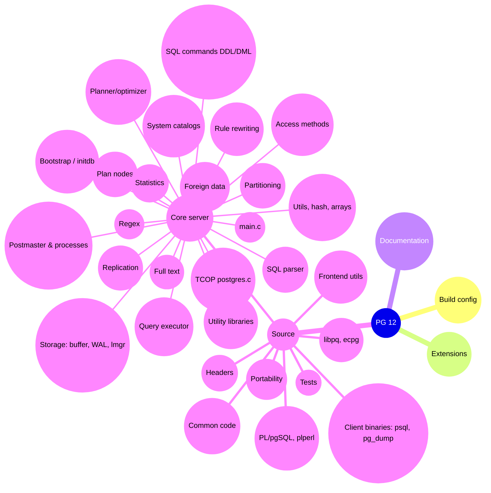

# PostgreSQL 12 Source Code Tree Overview

This page provides a visual diagram and explanations of the main code areas in the PostgreSQL 12 source tree (`raw/postgres-12@45b88269a353ad93744772791feb6d01bc7e1e42`). The diagram helps humans navigate the directory structure, highlighting key subsystems.

## Diagram

## Main Code Areas

### src/backend/ - Core Server Logic

- **access/**: Table and index access methods (heap, btree, gin, gist, hash, brin, spgist). `raw/postgres-12/src/backend/access/heap/README`, `access/nbtree/README`, `access/gin/README`, `access/heap/README.HOT`.
- **bootstrap/**: Cluster initialization (initdb backend). `raw/postgres-12/src/backend/bootstrap/bootstrap.c`.
- Key: boot_parse, boot_yyparse for initial catalogs.
- **catalog/**: System catalogs (pg_class, pg_attribute, etc.). `raw/postgres-12/src/backend/catalog/heap.c`, `catalog/pg_class.h`, `catalog/indexing.c`.
- **commands/**: SQL command processing (DDL/DML: CREATE TABLE, ANALYZE, VACUUM). `raw/postgres-12/src/backend/commands/tablecmds.c`, `commands/analyze.c`, `commands/vacuum.c`.
- **executor/**: Query execution engine. `raw/postgres-12/src/backend/executor/execMain.c:ExecutorRun`, `executor/README`, `executor/nodeSeqscan.c`.
- **nodes/**: Node types for parse trees, plans, PlanState. `raw/postgres-12/src/backend/nodes/README`, `nodes/parsenodes.h`, `nodes/plannodes.h`.
- **optimizer/**: Query planning/optimizer. `raw/postgres-12/src/backend/optimizer/README`, `optimizer/plan/planner.c`, `optimizer/path/allpaths.c`.
- **parser/**: SQL parsing (gram.y bison). `raw/postgres-12/src/backend/parser/README`, `parser/gram.y`, `parser/scan.l`.
- **postmaster/**: Postmaster & backend processes (autovacuum, bgwriter, etc.). `raw/postgres-12/src/backend/postmaster/postmaster.c`, `postmaster/autovacuum.c`.
- **storage/**: Storage manager (buffers, WAL, lock manager, SMGR). `raw/postgres-12/src/backend/storage/buffer/README`, `storage/buffer/bufmgr.c`, `storage/wal/xlog.c`, `storage/lmgr/README`.
- **tcop/**: TCOP (postgres.c query dispatcher). `raw/postgres-12/src/backend/tcop/postgres.c:exec_simple_query`, `tcop/dest.c`.
- **utils/**: Utilities, data types, hash tables, arrays. `raw/postgres-12/src/backend/utils/adt/`, `utils/hash/`, `utils/resowner/README`.

### Other Areas

- **config/**: Autoconf build configuration.
- **contrib/**: Contributed extensions (pg_stat_statements, pgcrypto). `raw/postgres-12/contrib/README`, `contrib/pg_stat_statements/README`.
- **doc/**: Documentation sources.

- **src/bin/**: Client tools (psql, pg_dump, pg_restore). `raw/postgres-12/src/bin/psql/psql.c`, `src/bin/pg_dump/`.
- **src/common/**: Shared code (base64, username, etc.).
- **src/pl/**: Procedural languages (plpgsql, plperl, plpython). `raw/postgres-12/src/pl/plpgsql/src/pl_exec.c`, `src/pl/plperl/README`.
- **src/interfaces/**: Client libraries (libpq, ecpg). `raw/postgres-12/src/interfaces/libpq/README`, `src/interfaces/ecpg/README.dynSQL`.
- **src/port/**: Platform portability. `raw/postgres-12/src/port/README`.
- **src/test/**: Regression/isolation tests. `raw/postgres-12/src/test/regress/README`, `src/test/isolation/README`.

## Verification

Structure confirmed via directory listings of `raw/postgres-12/` at pinned commit `45b88269a353ad93744772791feb6d01bc7e1e42`. Citations point to representative files/symbols.
