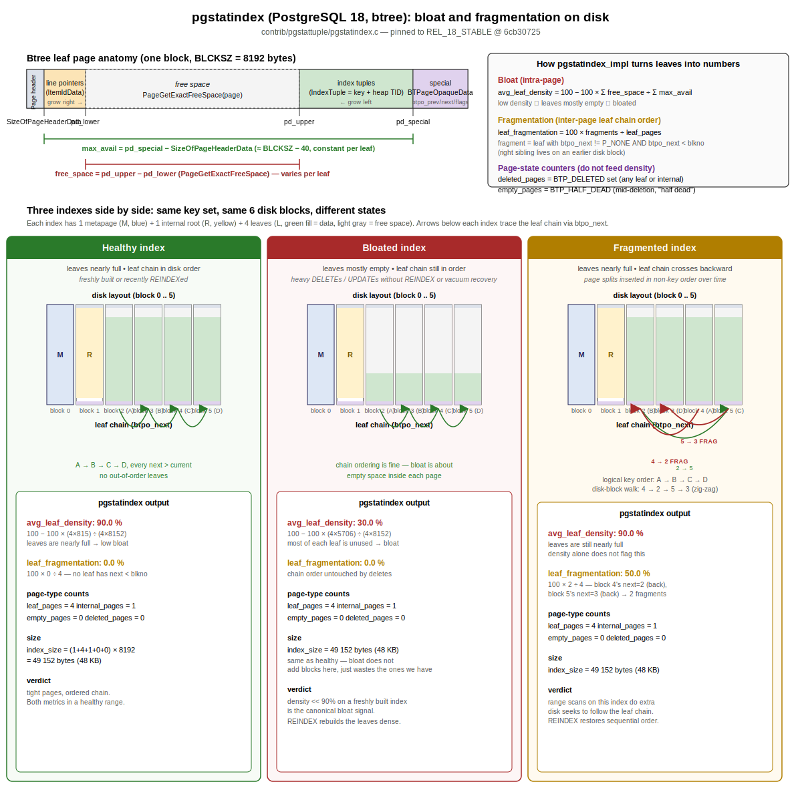

# pgstatindex

## Scope

This page traces what happens in PostgreSQL 18 when a user calls `pgstatindex('idx_name')` from the `pgstattuple` contrib extension. `pgstatindex` only operates on btree indexes; the sibling functions `pgstatginindex` and `pgstathashindex` cover GIN and hash indexes and are noted at the bottom of this page but not traced in detail.

Representative shape:

```sql
SELECT * FROM pgstatindex('public.t_pkey');
```

## Picture



The diagram in [pgstatindex.svg](pgstatindex.svg) is in three parts:

1. **Btree leaf page anatomy** (top-left). One block, BLCKSZ = 8192 bytes. Shows the page header, line pointers, free-space gap, index tuples, and the special area carrying `BTPageOpaqueData`. Two brackets pin down the two byte ranges `pgstatindex` actually measures: `max_avail = pd_special − SizeOfPageHeaderData` (constant per leaf) and `free_space = pd_upper − pd_lower` (varies per leaf).
2. **The two formulas** (top-right). `avg_leaf_density` derives from the ratio of summed free space to summed `max_avail`; `leaf_fragmentation` derives from how many leaves have `btpo_next < blkno`. The page-state counters (`deleted_pages`, `empty_pages`) are listed separately because they do not feed density.
3. **Three concrete indexes side by side** (bottom). All three have the same shape — 1 metapage, 1 internal root, 4 leaves — but in different states:
    - **Healthy**: leaves nearly full (≈90% density), leaf chain `A → B → C → D` matches disk order `2 → 3 → 4 → 5`. `avg_leaf_density = 90.0%`, `leaf_fragmentation = 0.0%`.
    - **Bloated**: leaves only ≈30% full, chain still in disk order. `avg_leaf_density` drops to `30.0%`; fragmentation stays at `0.0%`. `index_size` is unchanged from healthy because bloat wastes the existing blocks rather than allocating new ones.
    - **Fragmented**: leaves still ≈90% full, but disk order `B, D, A, C` does not match key order `A → B → C → D`. The leaf chain therefore walks `4 → 2 → 5 → 3`. Two of the four `btpo_next` arrows point at lower blocks (block 4's next is 2, block 5's next is 3), so `fragments = 2` and `leaf_fragmentation = 50.0%`. Density is unchanged from healthy.

These three panels make the split between the two metrics visible: density is an intra-page measurement (how full each leaf is), fragmentation is an inter-page ordering measurement (does the chain run forward on disk). A given index can score well on one and badly on the other.

## High-Level Flow

1. The SQL call lands in one of four C entry points (`pgstatindex`, `pgstatindexbyid`, and their `_v1_5` variants). The v1.0 variants enforce `superuser()`; v1.5 variants do not, since v1.5 revokes `EXECUTE` from `PUBLIC` at extension level.
2. The relation is opened with `AccessShareLock`. No exclusive locks are taken, so the index can be read concurrently with normal queries and modifications.
3. `pgstatindex_impl` validates the input: the relation must be an index using the btree access method, must not be another session's temp index, and must have `indisvalid = true`.
4. Block 0 (the btree metapage) is read once and parsed into `BTMetaPageData` to capture `btm_version`, `btm_level`, and `btm_root`.
5. Every other block (`blkno = 1 .. RelationGetNumberOfBlocks(rel) - 1`) is read with a `BAS_BULKREAD` ring buffer, share-locked, classified by the page's `btpo_flags`, then unlocked and released. `CHECK_FOR_INTERRUPTS()` runs each iteration so the scan can be cancelled.
6. The per-page classifier increments one of four counters (`deleted_pages`, `empty_pages`, `leaf_pages`, `internal_pages`). For leaf pages it also accumulates two density inputs (`max_avail`, `free_space`) and counts `fragments` (a leaf whose right sibling has a smaller block number).
7. After the loop closes the relation, the function builds a 10-column result tuple, including derived values `index_size`, `avg_leaf_density`, and `leaf_fragmentation`.

## Detailed Flow

| Step | Function / Macro | File | Notes |
|---|---|---|---|
| 1 | `pgstatindex` / `pgstatindexbyid` | `contrib/pgstattuple/pgstatindex.c` | v1.0 entry points; check `superuser()`, then call `pgstatindex_impl`. |
| 2 | `pgstatindex_v1_5` / `pgstatindexbyid_v1_5` | `contrib/pgstattuple/pgstatindex.c` | v1.5 entry points; no superuser check (rely on `REVOKE EXECUTE`). |
| 3 | `relation_openrv` / `relation_open` | `src/backend/access/common/relation.c` | Opens the index with `AccessShareLock`. |
| 4 | `pgstatindex_impl` | `contrib/pgstattuple/pgstatindex.c` | Validates `IS_INDEX` && `IS_BTREE`, rejects `RELATION_IS_OTHER_TEMP`, requires `rd_index->indisvalid`. |
| 5 | `GetAccessStrategy(BAS_BULKREAD)` | `src/backend/storage/buffer/freelist.c` | Ring-buffer access strategy used for the metapage read and the per-block loop. |
| 6 | `ReadBufferExtended(rel, MAIN_FORKNUM, 0, RBM_NORMAL, bstrategy)` | `src/backend/storage/buffer/bufmgr.c` | Reads the btree metapage at block 0. |
| 7 | `BTPageGetMeta(page)` | `src/include/access/nbtree.h` | Returns `BTMetaPageData *`; captures `btm_version`, `btm_level`, `btm_root`. |
| 8 | `RelationGetNumberOfBlocks(rel)` | `src/include/utils/rel.h` | Drives the per-block loop bound. |
| 9 | per-block `ReadBufferExtended` + `LockBuffer(BUFFER_LOCK_SHARE)` | `src/backend/storage/buffer/bufmgr.c` | Each non-meta block is share-locked while inspected. |
| 10 | `BTPageGetOpaque(page)` | `src/include/access/nbtree.h` | Reads `BTPageOpaqueData` from the page's special area. |
| 11 | `P_ISDELETED(opaque)` | `src/include/access/nbtree.h` | Tests `BTP_DELETED`; matches both leaf and internal pages, lumped together as deleted. |
| 12 | `P_IGNORE(opaque)` | `src/include/access/nbtree.h` | Tests `BTP_DELETED|BTP_HALF_DEAD`; reached only when `P_ISDELETED` is false, so this branch counts half-dead pages. |
| 13 | `P_ISLEAF(opaque)` | `src/include/access/nbtree.h` | Tests `BTP_LEAF`. Leaf branch also accumulates `max_avail` and `free_space`. |
| 14 | `PageGetExactFreeSpace(page)` | `src/backend/storage/page/bufpage.c` | Per-leaf free-space contribution. |
| 15 | `opaque->btpo_next` check | `contrib/pgstattuple/pgstatindex.c` | Counts `fragments` when the right-sibling block number is smaller than the current block (out-of-order leaf chain). |
| 16 | `relation_close(rel, AccessShareLock)` | `src/backend/access/common/relation.c` | Released after the loop, before the result tuple is built. |
| 17 | `BuildTupleFromCStrings` | `src/backend/executor/execTuples.c` | Builds the returned composite tuple from 10 string-formatted values. |

## Page Classification

The `if / else if / else` chain in `pgstatindex_impl` runs in this order, so each non-meta page lands in exactly one bucket:

| Order | Test | Counter | Meaning |
|---|---|---|---|
| 1 | `P_ISDELETED(opaque)` | `deleted_pages++` | Page is fully deleted; leaf vs. internal is not distinguished. |
| 2 | `P_IGNORE(opaque)` (after deleted) | `empty_pages++` | Half-dead page (mid-deletion). The result column is named `empty_pages` even though the underlying state is "half dead". |
| 3 | `P_ISLEAF(opaque)` | `leaf_pages++` plus density and fragment accumulators | Live leaf page. |
| 4 | else | `internal_pages++` | Live internal (branch) page. |

Leaf-only accumulators:

- `max_avail += BLCKSZ - (BLCKSZ - pd_special + SizeOfPageHeaderData)`, which simplifies to `pd_special - SizeOfPageHeaderData`, the byte range between the page header and the special area on a leaf page.
- `free_space += PageGetExactFreeSpace(page)`, the unused bytes on the leaf.
- `fragments++` when `btpo_next != P_NONE && btpo_next < blkno`. The btree leaf chain is logically left-to-right; a leaf whose right sibling lives on an earlier block is treated as a fragmentation event.

## Output Columns

`pgstatindex_impl` returns a 10-column composite (`BuildTupleFromCStrings`):

| Column | Source |
|---|---|
| `version` | `BTMetaPageData.btm_version` |
| `tree_level` | `BTMetaPageData.btm_level` |
| `index_size` | `(1 + leaf_pages + internal_pages + deleted_pages + empty_pages) * BLCKSZ` (the leading `1` is the metapage). |
| `root_block_no` | `BTMetaPageData.btm_root` |
| `internal_pages` | live non-leaf, non-deleted pages |
| `leaf_pages` | live leaf pages |
| `empty_pages` | half-dead pages |
| `deleted_pages` | pages with `BTP_DELETED` |
| `avg_leaf_density` | `100 - 100 * free_space / max_avail`; `'NaN'` when `max_avail = 0` |
| `leaf_fragmentation` | `100 * fragments / leaf_pages`; `'NaN'` when `leaf_pages = 0` |

## Notes And Caveats

- Btree only. Calls against GIN, hash, BRIN, or other index AMs raise `relation "..." is not a btree index`.
- `AccessShareLock` plus per-page `BUFFER_LOCK_SHARE` means the function does not block writers, but it does walk every non-meta block sequentially and is therefore O(index size).
- `BAS_BULKREAD` is used for both the metapage read and the per-block loop, so the scan does not evict the index's hot pages from shared buffers.
- The function rejects `!indisvalid` indexes outright, so `CREATE INDEX CONCURRENTLY` failures and partial indexes left in an unready state must be fixed before they can be measured.
- "Fragmentation" is a leaf-chain ordering metric; it does not measure intra-page free space.

## Sibling Functions In contrib/pgstattuple/pgstatindex.c

| Function | Index AM | Notes |
|---|---|---|
| `pgstatindex` / `pgstatindexbyid` (and `_v1_5`) | btree | Function traced on this page. |
| `pgstatginindex` / `pgstatginindex_v1_5` | GIN | Reads only the GIN metapage at `GIN_METAPAGE_BLKNO`; returns `version`, `pending_pages`, `pending_tuples`. No per-block scan. |
| `pgstathashindex` | hash | Per-block scan classified by `hasho_flag & LH_PAGE_TYPE` into bucket / overflow / bitmap / unused; aggregates live and dead items via `GetHashPageStats`. |
| `pg_relpages` / `pg_relpagesbyid` (and `_v1_5`) | any AM with storage | Returns `RelationGetNumberOfBlocks(rel)` only; no page inspection. |

## Cross-Links

- [[v18/index]]
- [[v18/subsystems/executor]]

## Source References

- `contrib/pgstattuple/pgstatindex.c` - `pgstatindex`, `pgstatindexbyid`, `pgstatindex_v1_5`, `pgstatindexbyid_v1_5`, `pgstatindex_impl`, `pgstatginindex_internal`, `pgstathashindex`, `pg_relpages_impl`, `GetHashPageStats`.
- `src/include/access/nbtree.h` - `BTPageOpaqueData`, `BTMetaPageData`, `BTPageGetMeta`, `BTPageGetOpaque`, `P_ISLEAF`, `P_ISDELETED`, `P_IGNORE`, `P_NONE`.
- `src/backend/storage/page/bufpage.c` - `PageGetExactFreeSpace`.
- `src/backend/storage/buffer/bufmgr.c` - `ReadBufferExtended`, `LockBuffer`, `UnlockReleaseBuffer`.
- `src/backend/storage/buffer/freelist.c` - `GetAccessStrategy(BAS_BULKREAD)`.
- `src/backend/executor/execTuples.c` - `BuildTupleFromCStrings`.

## Open Questions

- Should the wiki gain a shared `nbtree-page-layout` concept page covering `BTPageOpaqueData`, `BTMetaPageData`, and the leaf/internal/deleted/half-dead state machine? It would be referenced from this page and from any future btree index code-path traces.
- Should sibling traces for `pgstatginindex` and `pgstathashindex` be filed as separate code-path pages, or folded into a single `pgstattuple-index-functions` page?
