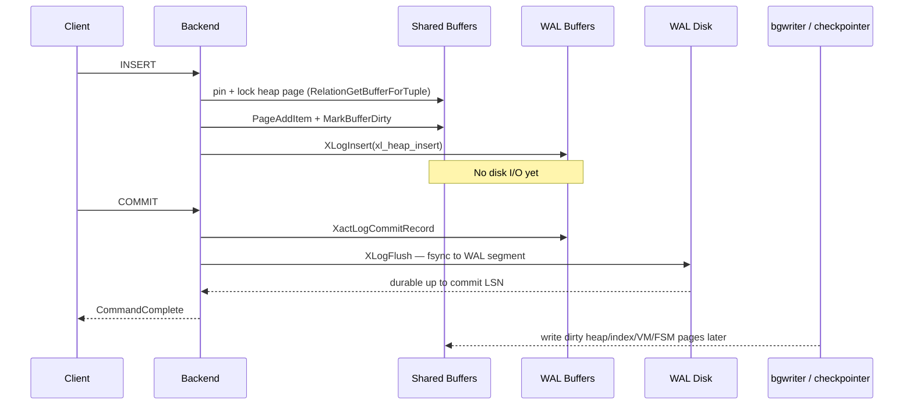

# Disk Writes During A Row INSERT Transaction

## Question

In PostgreSQL 18, what internal operations actually write to disk when a single row is inserted inside a transaction?

## Short Answer

Assume PostgreSQL 18, the primary version in [[versions]]. For `BEGIN; INSERT INTO t VALUES (...); COMMIT;` against a heap table with default `synchronous_commit = on`, the only **synchronous** disk write is the WAL flush at commit. Heap pages, index pages, and TOAST pages are dirtied in shared buffers and written out **asynchronously** by the bgwriter and the checkpointer. CLOG, visibility map, and free-space-map updates are also buffered and flushed asynchronously. Citations: `raw/postgres-18/src/backend/access/heap/heapam.c:heap_insert`, `raw/postgres-18/src/backend/access/transam/xact.c:RecordTransactionCommit`, `raw/postgres-18/src/backend/access/transam/xact.c:1502`.

This page traces the call chain from `ExecInsert` down to the WAL flush at commit, identifies which steps could trigger I/O versus which only dirty in-memory buffers, and notes the configuration knobs that change the answer.

## Call Chain From Executor To Heap AM

`ExecInsert` is the executor entry point for a `ModifyTable` insert subnode. It does not call `heap_insert` directly; it goes through the table-AM dispatch layer:

- `ExecInsert` calls `table_tuple_insert(resultRelationDesc, slot, …)` at `raw/postgres-18/src/backend/executor/nodeModifyTable.c:1234`. Citation: `raw/postgres-18/src/backend/executor/nodeModifyTable.c:ExecInsert`.
- `table_tuple_insert` is the TAM-agnostic wrapper in `tableam.h`; for heap tables it routes to the heap-AM callback `heapam_tuple_insert` at `raw/postgres-18/src/backend/access/heap/heapam_handler.c:244`. That callback extracts a `HeapTuple` from the slot and calls `heap_insert(relation, tuple, cid, options, bistate)` at `raw/postgres-18/src/backend/access/heap/heapam_handler.c:255`. Citation: `raw/postgres-18/src/backend/access/heap/heapam_handler.c:heapam_tuple_insert`.
- `heap_insert` lives in `heapam.c:2080`. It is the function that actually mutates a heap page and emits WAL. Citation: `raw/postgres-18/src/backend/access/heap/heapam.c:heap_insert`.

For the `INSERT ... ON CONFLICT` path the dispatch routes through `heapam_tuple_insert_speculative` at `heapam_handler.c:263` instead, but the on-disk steps below still apply.

See [[v18/code-paths/insert-path]] for the full upper-stack walk through parse/analyze/plan/portal.

## Inside `heap_insert`: What Each Step Touches

The relevant ordering inside `heap_insert` for a non-TOAST, single-row insert into a permanent (WAL-logged) relation is:

1. `heap_prepare_insert` — set `t_xmin`, `t_cid`, infomask, `t_ctid`, and detoast/copy the tuple if needed. Pure CPU. Citation: `raw/postgres-18/src/backend/access/heap/heapam.c:heap_prepare_insert`.
2. `RelationGetBufferForTuple` — pin and exclusive-lock a heap buffer with room for the tuple, possibly extending the relation. The `PageInit` of a freshly extended page happens here. The buffer is touched in shared buffers; no synchronous disk write is required, and any extending write is buffered. Citation: `raw/postgres-18/src/backend/access/heap/hio.c:RelationGetBufferForTuple`.
3. `RelationPutHeapTuple` → `PageAddItem` — copy the tuple onto the page in shared buffers. CPU only.
4. `MarkBufferDirty(buffer)` — mark the buffer dirty so it will eventually be written by bgwriter or checkpointer. No disk I/O. Citation: `raw/postgres-18/src/backend/access/heap/heapam.c:2155`.
5. If `RelationNeedsWAL(relation)`: build an `xl_heap_insert` record and call `XLogBeginInsert` / `XLogRegisterData` / `XLogRegisterBuffer` / `XLogRegisterBufData` / `XLogInsert(RM_HEAP_ID, XLOG_HEAP_INSERT | …)`. `XLogInsert` reserves space in the in-memory WAL buffers and copies the record there; it does **not** flush. The returned LSN is stamped into the page header via `PageSetLSN`. Citations: `raw/postgres-18/src/backend/access/heap/heapam.c:2231`, `raw/postgres-18/src/backend/access/transam/xloginsert.c:XLogInsert`.
6. `END_CRIT_SECTION` and `UnlockReleaseBuffer`. Citations: `raw/postgres-18/src/backend/access/heap/heapam.c:2236`, `raw/postgres-18/src/backend/access/heap/heapam.c:2238`.
7. `pgstat_count_heap_insert(relation, 1)` — bumps in-memory cumulative stats. Citation: `raw/postgres-18/src/backend/access/heap/heapam.c:2251`.

After `heap_insert` returns, the durable state of the cluster on disk is **unchanged**: the new tuple lives only in shared buffers and in WAL buffers.

`UNLOGGED` tables short-circuit step 5 (`RelationNeedsWAL` returns false) and never write WAL for inserts; their data also bypasses the commit-time fsync below.

## Side Effects That Also Only Dirty Buffers

A real insert can also touch:

- **Indexes.** `ExecInsertIndexTuples` walks each index on the result relation and calls `index_insert`, which routes to the AM-specific entry point (`btinsert` for btree, etc.). Each AM emits its own WAL record and dirties index buffers; nothing is fsynced inline. Citations: `raw/postgres-18/src/backend/executor/execIndexing.c:ExecInsertIndexTuples`, `raw/postgres-18/src/backend/access/index/indexam.c:index_insert`.
- **TOAST.** When a tuple has out-of-line attributes, `heap_toast_insert_or_update` inserts chunk rows into the TOAST relation and its TOAST index before the heap-table insert returns. Each chunk goes through the same `heap_insert` + index-insert dance, all buffered. Citation: `raw/postgres-18/src/backend/access/table/toast_helper.c:toast_tuple_externalize`, `raw/postgres-18/src/backend/access/heap/heaptoast.c:heap_toast_insert_or_update`.
- **Visibility map.** If the page being inserted into is currently all-visible, `heap_insert` clears the VM bit before dirtying the heap page (`visibilitymap_clear`, called near `heapam.c:2138`). Updates the VM buffer in memory only. Citation: `raw/postgres-18/src/backend/access/heap/visibilitymap.c:visibilitymap_clear`.
- **Free space map.** `RelationGetBufferForTuple` consults and may update FSM pages through `RecordPageWithFreeSpace`; FSM writes are dirtied in shared buffers and never WAL-logged. Citation: `raw/postgres-18/src/backend/access/brin/brin_xlog.c` is unrelated; the relevant file is `raw/postgres-18/src/backend/storage/freespace/freespace.c:RecordPageWithFreeSpace`.
- **CLOG.** The transaction's commit status will be written to CLOG by `TransactionIdCommitTree` at commit time, but CLOG pages are buffered in shared memory; they are not synchronously fsynced as part of the commit path. Citation: `raw/postgres-18/src/backend/access/transam/clog.c:TransactionIdSetTreeStatus`.

So at the moment the user types `COMMIT`, every heap, index, TOAST, VM, FSM, and CLOG mutation lives in shared buffers; the only durable record of the insert is whatever has reached the WAL stream.

## The Synchronous Write: WAL Flush At Commit

The commit path is:

1. `exec_simple_query` finishes executing the statement and returns to the main loop. On `COMMIT`, `CommitTransactionCommand` is invoked. Citation: `raw/postgres-18/src/backend/access/transam/xact.c:CommitTransactionCommand`.
2. `CommitTransaction` (`xact.c:2228`) drives the commit machinery and calls `RecordTransactionCommit`. Citation: `raw/postgres-18/src/backend/access/transam/xact.c:CommitTransaction`.
3. `RecordTransactionCommit` (`xact.c:1315`) builds the `xl_xact_commit` record via `XactLogCommitRecord` and, if any WAL was written and `synchronous_commit > SYNCHRONOUS_COMMIT_OFF`, calls `XLogFlush(XactLastRecEnd)` at `xact.c:1502`. `XLogFlush` is the routine that issues `write()` and `fsync()` against the active WAL segment up to the commit LSN, using whichever syscall family `wal_sync_method` selected. Citations: `raw/postgres-18/src/backend/access/transam/xact.c:RecordTransactionCommit`, `raw/postgres-18/src/backend/access/transam/xact.c:1502`, `raw/postgres-18/src/backend/access/transam/xlog.c:XLogFlush`.
4. After the WAL flush returns, `RecordTransactionCommit` updates CLOG via `TransactionIdCommitTree` and reports the commit LSN; the backend then sends `CommandComplete` and `ReadyForQuery` to the client.

This single `XLogFlush` is the only call in the insert/commit path that *must* hit disk before the client is told the transaction succeeded. Crash recovery uses the WAL stream to replay the buffered heap/index/TOAST/VM/CLOG mutations.

`synchronous_commit` controls this flush:

- `on` (default), `remote_write`, `remote_apply` — local fsync happens before the client is acknowledged (replication semantics layer on top).
- `local` — local fsync happens but the backend does not wait for replicas.
- `off` — `RecordTransactionCommit` skips `XLogFlush` and instead asks the WAL writer to flush asynchronously; the commit is acknowledged before durability. The page is no longer "synchronous insert" at all in this mode.
- `remote_apply` / `remote_write` add waits for replicas after the local flush.

Citation for the branching: `raw/postgres-18/src/backend/access/transam/xact.c:1490-1525`.

## Asynchronous Writes That Eventually Hit Disk

Everything dirtied above is written to disk by background processes, not the inserting backend:

- `bgwriter` continuously writes a fraction of dirty shared buffers to keep clean buffers available, and respects `bgwriter_*` GUCs. Citation: `raw/postgres-18/src/backend/postmaster/bgwriter.c:BackgroundWriterMain`.
- The `checkpointer` performs full checkpoints on `checkpoint_timeout` / `max_wal_size` boundaries, fsyncing every dirty buffer for the affected relations. Citation: `raw/postgres-18/src/backend/postmaster/checkpointer.c:CheckpointerMain`.
- The `walwriter` writes pending WAL buffers to disk for asynchronous-commit transactions; synchronous commits already drove this work in `XLogFlush`. Citation: `raw/postgres-18/src/backend/postmaster/walwriter.c:WalWriterMain`.
- Autovacuum eventually visits the inserted tuple via the INSERT-vacuum trigger (`autovacuum_vacuum_insert_threshold`), at which point heap pruning and visibility-map updates can happen. See [[shared/autovacuum-evolution]].

## Sequence Diagram

## Variants And When The Answer Changes

- `synchronous_commit = off` → no synchronous disk write at commit; the only durability comes from the walwriter draining WAL buffers later.
- `UNLOGGED` table → `RelationNeedsWAL` is false, no WAL is emitted, and the commit path does not need to flush WAL for that relation.
- `INSERT ... ON CONFLICT` → uses `heap_insert_speculative` and a confirm/abort follow-up, but commit-time WAL flush behaves the same.
- Multi-row `INSERT` and `COPY` → use `heap_multi_insert` (`heapam.c:2351`) which batches WAL via `XLOG_HEAP2_MULTI_INSERT`. Same commit semantics.
- Foreign-table inserts via FDW → no heap write happens locally; commit-time durability depends on the FDW's two-phase or non-2PC behavior.
- `BEGIN; INSERT; ROLLBACK;` → no commit record is written; if `XLogFlush` already ran for some other reason (e.g. an intervening `synchronous_commit`-forcing operation), WAL contains the insert, but recovery sees no commit record and discards the change.

## Cross-Links

- [[v18/code-paths/insert-path]] — full upper-stack walk to `ExecInsert`.
- [[shared/concepts/modifytable]] — `ModifyTable` plan node family.
- [[shared/concepts/tuple-table-slot]] — slot from which `heapam_tuple_insert` extracts the tuple.
- [[shared/autovacuum-evolution]] — INSERT-driven autovacuum triggers that follow.

## Source References

- `raw/postgres-18/src/backend/executor/nodeModifyTable.c:ExecInsert`
- `raw/postgres-18/src/backend/executor/execIndexing.c:ExecInsertIndexTuples`
- `raw/postgres-18/src/backend/access/heap/heapam_handler.c:heapam_tuple_insert`
- `raw/postgres-18/src/backend/access/heap/heapam.c:heap_insert`
- `raw/postgres-18/src/backend/access/heap/heapam.c:heap_prepare_insert`
- `raw/postgres-18/src/backend/access/heap/hio.c:RelationGetBufferForTuple`
- `raw/postgres-18/src/backend/access/heap/heaptoast.c:heap_toast_insert_or_update`
- `raw/postgres-18/src/backend/access/heap/visibilitymap.c:visibilitymap_clear`
- `raw/postgres-18/src/backend/storage/freespace/freespace.c:RecordPageWithFreeSpace`
- `raw/postgres-18/src/backend/access/transam/xloginsert.c:XLogInsert`
- `raw/postgres-18/src/backend/access/transam/xlog.c:XLogFlush`
- `raw/postgres-18/src/backend/access/transam/xact.c:CommitTransaction`
- `raw/postgres-18/src/backend/access/transam/xact.c:RecordTransactionCommit`
- `raw/postgres-18/src/backend/access/transam/xact.c:1502`
- `raw/postgres-18/src/backend/access/transam/clog.c:TransactionIdSetTreeStatus`
- `raw/postgres-18/src/backend/postmaster/bgwriter.c:BackgroundWriterMain`
- `raw/postgres-18/src/backend/postmaster/checkpointer.c:CheckpointerMain`
- `raw/postgres-18/src/backend/postmaster/walwriter.c:WalWriterMain`

## Open Questions

- Index AM behaviour around `RelationNeedsWAL`: every in-tree btree/hash/gist/gin/spgist/brin path emits WAL inside `aminsert` for permanent relations, but the exact branching for `UNLOGGED` index-on-permanent-table edge cases (and vice versa) is not traced here. A follow-up should walk `index_insert` for each AM and confirm WAL emission and dirty-buffer behaviour match `heap_insert`.
- WAL flush ordering with replication: under `synchronous_commit = remote_apply` the local `XLogFlush` returns, but `SyncRepWaitForLSN` then waits for the standby to apply. This page calls out the local fsync only; the replication-side wait deserves its own page once a `replication` subsystem is documented.
- `heap_multi_insert` batching vs. single-row `heap_insert`: WAL volume per row differs (one `XLOG_HEAP2_MULTI_INSERT` covers many tuples), but the commit-path flush is identical. Worth documenting the per-row WAL byte savings if a `bulk-insert-path` page is filed.
