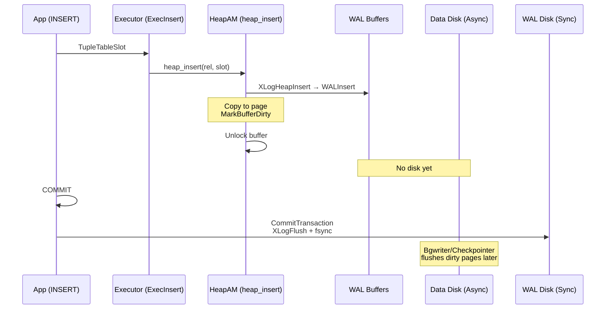

# Disk Writes During Row Insert Transaction

## Question
In PostgreSQL 18, explain all the internal operations that write to disk when a row is inserted in a db transaction.

## Answer

PostgreSQL 18 (pinned: `REL_18_STABLE@6cb307251c5c6261286c1566496920976640108e` in `raw/postgres-18/`) follows standard MVCC + WAL design for inserts. **No data pages (heap/index) are synchronously written to disk during insert or commit.** The sole **synchronous disk write** is the WAL fsync at transaction commit for crash durability. Heap/index pages are dirtied in shared buffers and flushed asynchronously by bgwriter/checkpointer.

This traces a simple `INSERT INTO table VALUES (...)` in a transaction (e.g., `BEGIN; INSERT; COMMIT;`), assuming no TOAST, no indexes, no speculative insert, default `synchronous_commit=on`. Covers high-level executor path (from [[v18/code-paths/insert-path]]) + storage details.

### 1. Insert Path to Storage (No Disk Writes)
From [[v18/code-paths/insert-path]]:

- `exec_simple_query` (`tcop/postgres.c`) → parse/analyze/plan → `ModifyTable` plan → `PortalRunMulti` → `ProcessQuery` → `ExecutorRun` → `ExecModifyTable` (`executor/nodeModifyTable.c`).
- `ExecModifyTable` (CMD_INSERT): Builds `TupleTableSlot`, calls **`ExecInsert`** (`executor/nodeModifyTable.c:ExecInsert`).

**ExecInsert** (`executor/nodeModifyTable.c`):
- Preps tuple (`ExecGetInsertNewTuple`).
- Calls **`heap_insert(rel, slot, cid, options, NULL)`** (`raw/postgres-18/src/backend/access/heap/heapam_handler.c:255,278`).

**heap_insert** (`access/heap/heapam_handler.c`):
1. `heap_prepare_insert`: t_ctid, infomask, etc. (`heapam.c`)
2. `RelationGetBufferForTuple`: Lock buffer, split if full (no write).
3. `XLogHeapInsert(rel, buffer, tuple)`: 
   - WAL record (RM_HEAP_ID, XLOG_HEAP_INSERT) (`heapam_xlog.c`).
   - `WALInsert` → WAL buffers (shared mem, no disk).
4. Copy tuple to page (`PageAddItem`).
5. **MarkBufferDirty(buffer)** → Dirty in shared buffers (no disk).
6. UnlockReleaseBuffer.
7. `pgstat_count_heap_insert(rel, 1)` (`pgstat_relation.c`).

**Result**: WAL in buffers, heap page dirtied. **No disk I/O**.

**Indexes** (if any): `ExecInsertIndexTuples` (`execIndexing.c`) → `index_insert` → WAL record per index → MarkBufferDirty. Same: buffered.

**TOAST** (large fields): `toast_insert_tuple` → heap_insert to toast rel. Buffered.

### 2. Transaction Commit: Synchronous WAL Flush (Disk Write #1)
- `COMMIT` → `CommitTransactionCommand` → `CommitTransaction` (`access/transam/xact.c:2228`).
- `XactLogCommitRecord` (multi-xact WAL).
- **`XLogFlush(XactLastRecEnd)`** (`xact.c:1502`): 
  - Flushes WAL buffers to WAL segment file.
  - `wal_fsync` (OS fsync) for durability.
- **Disk write**: WAL segment (sync). Ensures replay on crash reconstructs insert.

### 3. Asynchronous Data Writes (Post-Commit)
- Dirty buffers → 
  - **Checkpointer** (checkpoint): Syncs all dirty at interval (`checkpoint_timeout`).
  - **Bgwriter** (`bgwriter.c`): Periodic flushes to prevent checkpoint storms.
- Visibility: xmin set; vacuum/autovacuum prunes later (INSERT triggers via `autovacuum_vac_ins_thresh`, per [[postgresql-18-autovacuum-analysis]]).

**Variants**:
- `synchronous_commit=local`: WAL flush, no fsync.
- `synchronous_commit=off/remote_apply`: WAL async.
- Partitioned: Route to child → same.
- Multi-row/bulk: `PageIndexMultiInsert` (batched WAL/dirty).

**No other sync writes**: CLOG (xid commit) buffered; pred locks async.

### Sequence Diagram

## Cross-Links
- [[v18/code-paths/insert-path]] (upper path to ExecInsert)
- [[shared/concepts/modifytable]] (ModifyTable)
- [[shared/concepts/tuple-table-slot]] (slots)
- [[postgresql-18-autovacuum-analysis]] (INSERT vacuum triggers)

## Source References
- `raw/postgres-18/src/backend/executor/nodeModifyTable.c` (ExecInsert)
- `raw/postgres-18/src/backend/access/heap/heapam_handler.c:255,278` (heap_insert)
- `raw/postgres-18/src/backend/access/transam/xact.c:2228,1502` (CommitTransaction, XLogFlush)

## Open Questions
- Extend to `INSERT ... SELECT` / bulk / speculative?
- Index-specific WAL details?
