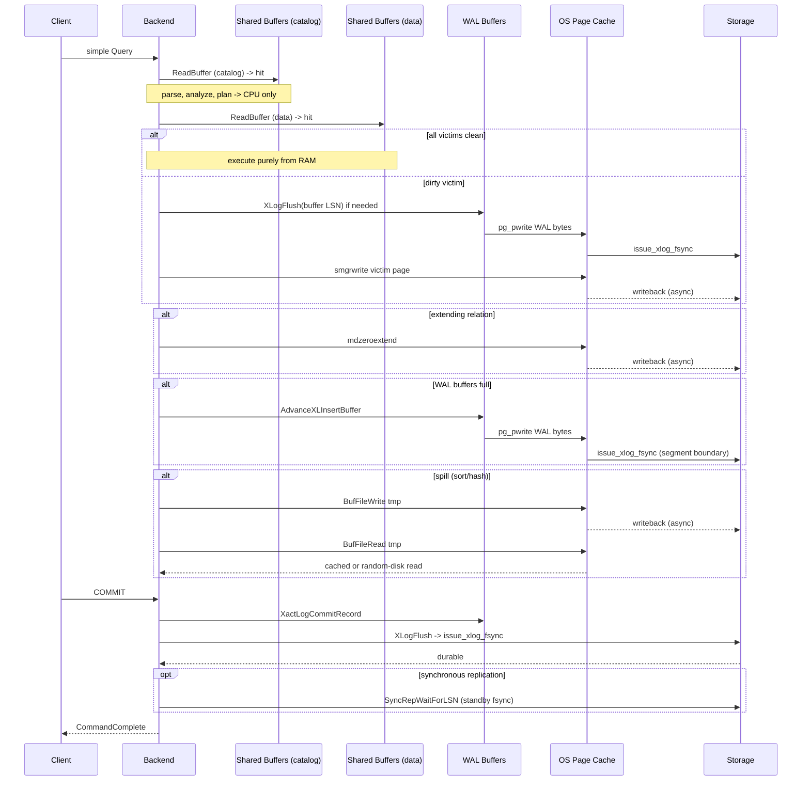

# Disk I/O Before And During Query Execution Even With Warm Caches

## Question

In PostgreSQL 18, what are all the potential disk I/O operations that happen
before query execution and during query execution, and how could a slow
random-I/O disk impact these processes even when all referenced blocks are
already in shared buffers and all on-disk files are cached in the operating
system page cache?

## Short Answer

Assume PostgreSQL 18, the primary version in [[versions]]. With shared buffers
and OS page cache fully warm, page **reads** for permanent relations,
catalogs, indexes, TOAST, FSM, VM, and SLRUs short-circuit at `BufferAlloc` /
`SimpleLruReadPage` and never call `smgrreadv` or `pg_pread`. The paths that
can still issue disk I/O fall into five categories:

1. **Synchronous WAL fsync at commit.** `RecordTransactionCommit` calls
   `XLogFlush(XactLastRecEnd)` for any WAL-logged transaction with
   `synchronous_commit > off`, which drives `XLogWrite` →
   `issue_xlog_fsync`. Citations:
   `raw/postgres-18/src/backend/access/transam/xact.c:1499-1502`,
   `raw/postgres-18/src/backend/access/transam/xlog.c:XLogFlush`,
   `raw/postgres-18/src/backend/access/transam/xlog.c:issue_xlog_fsync`.
2. **WAL buffer wraparound during execution.** `XLogInsert` →
   `GetXLogBuffer` → `AdvanceXLInsertBuffer` issues `XLogWrite` (and on a
   segment boundary, `issue_xlog_fsync`) when no insertion buffer is free,
   incrementing `pgWalUsage.wal_buffers_full`. Citations:
   `raw/postgres-18/src/backend/access/transam/xlog.c:GetXLogBuffer`,
   `raw/postgres-18/src/backend/access/transam/xlog.c:AdvanceXLInsertBuffer`,
   `raw/postgres-18/src/backend/access/transam/xlog.c:2061`.
3. **Dirty victim writeback during buffer allocation.** When shared buffers
   are full of dirty pages, `GetVictimBuffer` calls `FlushBuffer` on the
   chosen victim before reuse; `FlushBuffer` issues `smgrwrite` plus
   `XLogFlush` of the page LSN if needed and calls
   `ScheduleBufferTagForWriteback` so the OS page cache flushes the
   write through to storage. Citations:
   `raw/postgres-18/src/backend/storage/buffer/bufmgr.c:GetVictimBuffer`,
   `raw/postgres-18/src/backend/storage/buffer/bufmgr.c:FlushBuffer`,
   `raw/postgres-18/src/backend/storage/buffer/bufmgr.c:ScheduleBufferTagForWriteback`.
4. **Relation extension.** `RelationGetBufferForTuple` →
   `ExtendBufferedRelBy` → `mdzeroextend` writes new zero-filled blocks
   directly through `smgr` and `register_dirty_segment`s them for
   later fsync. Citations:
   `raw/postgres-18/src/backend/access/heap/hio.c:RelationGetBufferForTuple`,
   `raw/postgres-18/src/backend/access/heap/hio.c:341`,
   `raw/postgres-18/src/backend/storage/buffer/bufmgr.c:ExtendBufferedRelBy`,
   `raw/postgres-18/src/backend/storage/smgr/md.c:register_dirty_segment`.
5. **Per-backend temporary files for spills.** `tuplesort`, `tuplestore`,
   `nodeHash` / `nodeHashjoin`, and hash aggregation spill through
   `BufFile` / `OpenTemporaryFile` to `base/pgsql_tmp` whenever a step
   does not fit in `work_mem` / `hash_mem_multiplier`. These I/Os go to
   the file system but are not normally fsynced; they still hit disk on
   read-back when the OS page cache evicts them. Citations:
   `raw/postgres-18/src/backend/storage/file/buffile.c:OpenTemporaryFile`,
   `raw/postgres-18/src/backend/storage/file/buffile.c:BufFileWrite`,
   `raw/postgres-18/src/backend/utils/sort/tuplesort.c`.

A slow random-I/O disk hurts these even with warm caches because every
`fsync` / `fdatasync` issued by `issue_xlog_fsync` and by the checkpointer's
`ProcessSyncRequests` waits for physical durability — the page cache is
write-back, not write-through, and the kernel must drain the inode's dirty
bytes plus journal metadata before the syscall returns. Background writers
sharing the same disk amplify this: bgwriter, checkpointer, walwriter, and
autovacuum all contend for the same I/O queue, so a backend's commit fsync
is serialized behind their dirty pages even when the backend itself read
nothing from disk.

## Pre-Execution Disk I/O Paths

For the simple-Query path the pre-execution stages are parse, analyze,
rewrite, and plan; for the extended/`PREPARE` path they include plan-cache
revalidation. See [[v18/code-paths/simple-select-query]] and
[[v18/questions/prepared-statement-replanning]]. With warm caches the only
on-disk traffic any of these can drive is:

- **Catalog buffer reads on cache miss.** `RelationBuildDesc`,
  `SearchCatCacheInternal`, and `systable_beginscan` enter the buffer manager
  through `ReadBuffer`. With shared buffers warm these resolve at
  `BufferAlloc`'s buffer-table hit path and never reach `smgrreadv`.
  Citations:
  `raw/postgres-18/src/backend/utils/cache/relcache.c:RelationBuildDesc`,
  `raw/postgres-18/src/backend/utils/cache/catcache.c:SearchCatCacheInternal`,
  `raw/postgres-18/src/backend/storage/buffer/bufmgr.c:BufferAlloc`,
  `raw/postgres-18/src/backend/storage/buffer/bufmgr.c:ReadBuffer_common`.
- **Plan-cache revalidation locks and dependency walks.** `GetCachedPlan` →
  `RevalidateCachedQuery` reacquires planner locks (`AcquirePlannerLocks`)
  and may rerun parse analysis if a sinval invalidation touched the saved
  query. Lock manager state is in shared memory; reanalysis costs the same
  catalog buffer reads as fresh planning. Citations:
  `raw/postgres-18/src/backend/utils/cache/plancache.c:GetCachedPlan`,
  `raw/postgres-18/src/backend/utils/cache/plancache.c:RevalidateCachedQuery`,
  `raw/postgres-18/src/backend/utils/cache/plancache.c:AcquirePlannerLocks`.
- **Statistics fetches.** `get_relation_info` opens index relations and
  reads `pg_class`, `pg_index`, `pg_statistic`, `pg_statistic_ext`, and
  extended-statistics rows through the syscache and relcache. Same buffer-
  manager path as the catalog reads above. Citation:
  `raw/postgres-18/src/backend/optimizer/util/plancat.c:get_relation_info`.
- **Pre-existing dirty-buffer eviction caused by planning.** Catalog reads
  happen through the regular shared buffer pool, so a catalog miss can land
  on a dirty victim and pay the writeback cost described in the next
  section even though the *target* of the planner's request is metadata.
- **No WAL emission.** Parse, analyze, rewrite, plan, and plan-cache
  revalidation do not call `XLogInsert` or `XLogFlush`; they cannot directly
  trigger WAL I/O.

So in steady-state pre-execution work, with warm caches, all hot reads stop
at shared buffers and there is no synchronous fsync. The only way the
planner stalls on disk is if it (a) hits a victim-buffer writeback during a
catalog read, or (b) is competing with another backend or the checkpointer
for the WAL or the shared bufmgr partition lock while that other party is
itself blocked on disk.

## Execution-Time Disk I/O Paths

`PortalStart` builds `QueryDesc`, `ExecutorStart` / `ExecutorRun` /
`ExecutorEnd` drive the plan tree, and each plan node interacts with storage
through the buffer manager, the WAL, the SLRU layer, or temp-file
infrastructure. See [[v18/subsystems/executor]] and
[[v18/code-paths/select-disk-io]] for the call structure.

### Buffer Reads

Every `heap_fetch`, `index_getnext_slot`, TOAST chunk fetch, FSM probe, and
VM probe lands in `ReadBuffer_common` → `PinBufferForBlock` → `BufferAlloc`.
On a shared-buffer hit the function returns the existing pinned buffer
without touching `smgr`. Citations:
`raw/postgres-18/src/backend/storage/buffer/bufmgr.c:ReadBuffer_common`,
`raw/postgres-18/src/backend/storage/buffer/bufmgr.c:1188-1262`,
`raw/postgres-18/src/backend/storage/buffer/bufmgr.c:BufferAlloc`.

On a shared-buffer miss the read goes through `StartReadBuffers` →
`smgrstartreadv` → `mdstartreadv` → `pg_preadv`. With the OS page cache
warm, `pg_preadv` returns from cached pages and does not stall the disk;
with cold OS cache the syscall blocks on physical I/O. PG 18's
`StartReadBuffers` / `WaitReadBuffers` split lets `read_stream.c` issue
multi-block prefetch and overlap I/O with computation. Citations:
`raw/postgres-18/src/backend/storage/buffer/bufmgr.c:StartReadBuffers`,
`raw/postgres-18/src/backend/storage/buffer/bufmgr.c:WaitReadBuffers`,
`raw/postgres-18/src/include/storage/read_stream.h`.

### Dirty Victim Writeback

If shared buffers are saturated with dirty pages, `BufferAlloc` drops to
`GetVictimBuffer`. When the chosen victim has `BM_DIRTY` set,
`GetVictimBuffer` calls `FlushBuffer` (after the WAL-LSN check) and then
`ScheduleBufferTagForWriteback`. Citations:
`raw/postgres-18/src/backend/storage/buffer/bufmgr.c:2345-2450`,
`raw/postgres-18/src/backend/storage/buffer/bufmgr.c:FlushBuffer:4265-4370`,
`raw/postgres-18/src/backend/storage/buffer/bufmgr.c:ScheduleBufferTagForWriteback:6406`.

`FlushBuffer` does three things that can stall on disk:

1. **`XLogFlush(buffer_lsn)`** — WAL-before-data: a dirty data page can
   only leave shared buffers after its last-modified WAL record is durable.
   This is a synchronous fsync if the WAL stream has not already been
   flushed past `buffer_lsn`. Citation:
   `raw/postgres-18/src/backend/storage/buffer/bufmgr.c:4348` (the
   `XLogFlush` call inside `FlushBuffer`).
2. **`smgrwrite`** — `mdwriteback`-time the dirty page contents go to
   the OS page cache through `pg_pwritev`. Cached writes return quickly,
   but the OS still must allocate dirty page slots; with the disk
   saturated, write-back throttling can block this syscall.
3. **`smgrwriteback`** — `IssuePendingWritebacks` invokes
   `sync_file_range` on Linux to nudge the kernel into starting writeout.
   It does not wait, but it ensures the disk queue keeps moving.

When the victim was allocated through a `BufferAccessStrategy` (e.g.
sequential scan, bulk write, vacuum), `StrategyRejectBuffer` will skip a
dirty victim that would force a WAL flush, falling back to a non-ring
buffer. Citation:
`raw/postgres-18/src/backend/storage/buffer/bufmgr.c:2417-2440`.

### Relation Extension

DML (`INSERT`, `COPY`, `UPDATE`, `CREATE TABLE AS`, `CTAS`, `CREATE INDEX`)
and bulk readers can extend a relation. `RelationGetBufferForTuple` decides
how many pages to add (`extend_by_pages`, capped at
`MAX_BUFFERS_TO_EXTEND_BY = 64`) and calls `ExtendBufferedRelBy`. That in
turn calls `mdzeroextend` (or the bulk-write path), which:

- writes the new zero-filled blocks via `pg_pwrite` / `posix_fallocate`
  through `smgr`, and
- calls `register_dirty_segment` so the segment is fsynced at the next
  checkpoint via `RegisterSyncRequest` to the checkpointer.

Citations:
`raw/postgres-18/src/backend/access/heap/hio.c:240-348`,
`raw/postgres-18/src/backend/storage/buffer/bufmgr.c:ExtendBufferedRelBy`,
`raw/postgres-18/src/backend/storage/smgr/md.c:472`,
`raw/postgres-18/src/backend/storage/smgr/md.c:register_dirty_segment:1499-1517`.

`mdzeroextend` is a synchronous write into the OS page cache. With a slow
disk, write-back throttling on the kernel can block the syscall before it
returns; the extension also serializes on the relation extension lock, so
one slow extender stalls every other backend that wants to extend the same
relation.

### WAL Emission

DML, hint-bit-setting reads, and any other modifying operation call
`XLogInsert(rmid, info)`. Inside `XLogInsert`:

- `GetXLogBuffer(insertPos, tli)` returns a pointer into the in-memory
  `XLogCtl->pages` ring. If the requested page has not yet been initialized
  it calls `AdvanceXLInsertBuffer`, which writes the oldest still-occupied
  buffer through `XLogWrite` to free a slot. `XLogWrite` issues
  `pg_pwrite` on the segment file and, on a segment boundary, calls
  `issue_xlog_fsync` immediately even outside `XLogFlush`. Citations:
  `raw/postgres-18/src/backend/access/transam/xlog.c:GetXLogBuffer:1635`,
  `raw/postgres-18/src/backend/access/transam/xlog.c:AdvanceXLInsertBuffer:1988-2070`,
  `raw/postgres-18/src/backend/access/transam/xlog.c:XLogWrite:2304-2560`,
  `raw/postgres-18/src/backend/access/transam/xlog.c:issue_xlog_fsync:8744`.
- The record body is memcpy'd into WAL buffers; no disk I/O occurs in the
  common case where the buffer ring is not full.

WAL buffer wraparound is the hidden way that pure execution work — even a
plain `INSERT` — can hit disk before commit. The metric
`pgWalUsage.wal_buffers_full` (incremented at `xlog.c:2063`) is the visible
sign of this stall.

### Hint Bits And Page Pruning

A `SeqScan` or `IndexScan` that finds a tuple whose `t_xmin`/`t_xmax`
infomask bits are not yet set will:

- consult CLOG via `TransactionIdDidCommit` →
  `TransactionIdGetStatus` (SLRU read), and
- set `HEAP_XMIN_COMMITTED` / `HEAP_XMIN_INVALID` /
  `HEAP_XMAX_COMMITTED` etc. on the heap tuple, calling `MarkBufferDirty`.

The CLOG read goes through `SimpleLruReadPage_ReadOnly`. With CLOG SLRU
warm this is a memory hit; otherwise the SLRU manager calls `pg_pread` on
`pg_xact/<segno>` and, if it had to evict a dirty SLRU page first, calls
`SlruInternalWritePage` → `pg_pwrite` to make room. Citations:
`raw/postgres-18/src/backend/access/transam/clog.c:TransactionIdGetStatus:735`,
`raw/postgres-18/src/backend/access/transam/slru.c:SimpleLruWritePage:732`,
`raw/postgres-18/src/backend/access/transam/slru.c:SlruInternalWritePage:652-728`.

The hint-bit dirty page itself does not force WAL emission (hint bits are
not WAL-logged unless `wal_log_hints` / `data_checksums` is on), but it
adds a dirty buffer that some later `GetVictimBuffer` will have to flush.
A read-only `SELECT` that sets hint bits on cold heap pages is therefore a
covert source of buffer-pool dirty pressure.

### Visibility Map And Free Space Map

`heap_insert`, `heap_update`, and HOT pruning may clear the VM bit
(`visibilitymap_clear`) and update FSM pages
(`RecordPageWithFreeSpace`). VM and FSM forks are read and dirtied
through the regular bufmgr path; their writes are eventually flushed by
bgwriter and the next checkpoint. Citations:
`raw/postgres-18/src/backend/access/heap/visibilitymap.c:visibilitymap_clear`,
`raw/postgres-18/src/backend/storage/freespace/freespace.c:RecordPageWithFreeSpace`.

### Multixact, SubTrans, CommitTs SLRUs

Locking, savepoints, and `track_commit_timestamp` add reads/writes to
`pg_multixact`, `pg_subtrans`, and `pg_commit_ts`. Each follows the same
SLRU pattern as CLOG: read on miss, write the dirty victim. Citations:
`raw/postgres-18/src/backend/access/transam/multixact.c`,
`raw/postgres-18/src/backend/access/transam/subtrans.c`,
`raw/postgres-18/src/backend/access/transam/commit_ts.c`.

### Temp Files For Spills

When `work_mem` (or `hash_mem_multiplier * work_mem` for hash-based nodes)
is exceeded, executor nodes spill through `BufFile`:

- **Sort.** `tuplesort` switches from in-memory quicksort to external
  merge, writing runs through `logtape.c` → `BufFile`. Citation:
  `raw/postgres-18/src/backend/utils/sort/tuplesort.c`,
  `raw/postgres-18/src/backend/utils/sort/logtape.c`.
- **Hash join.** `nodeHashjoin` partitions the inner side into batch files
  when the hash table does not fit; both inner and outer batches roundtrip
  through temp files. Citation:
  `raw/postgres-18/src/backend/executor/nodeHashjoin.c`.
- **Hash aggregate.** `nodeAgg` spills overflow groups through
  `tuplesort` / `BufFile` since PG 13. Citation:
  `raw/postgres-18/src/backend/executor/nodeAgg.c`.
- **Tuplestore.** `Materialize`, `WindowAgg`, `CTE`, `Recursive Union`,
  cursor materialization, and SRFs spill through `tuplestore`. Citation:
  `raw/postgres-18/src/backend/utils/sort/tuplestore.c`.
- **Parallel shared spills.** `sharedtuplestore.c` adds DSM-mediated temp
  files for parallel workers.

Temp files are not WAL-logged and not fsynced. They are written to the OS
page cache; the OS may reuse those pages for read-back without going to
disk, but for spills larger than `effective_cache_size` and competitor
workloads the OS will evict and re-read. Random-I/O latency dominates
these read-backs.

## Commit-Time Synchronous I/O

The synchronous boundary for any WAL-logged transaction is at
`CommitTransaction`. The condition for a synchronous flush is in
`xact.c:1499-1502`:

```
if ((wrote_xlog && markXidCommitted &&
     synchronous_commit > SYNCHRONOUS_COMMIT_OFF) ||
    forceSyncCommit || nrels > 0)
{
    XLogFlush(XactLastRecEnd);
    ...
}
```

`XLogFlush` waits if needed for `WALWriteLock`, calls `XLogWrite`, and
then calls `issue_xlog_fsync` on each segment up to the commit LSN.
`issue_xlog_fsync` dispatches on `wal_sync_method`:

- `fsync` → `pg_fsync` (calls `fsync(fd)`)
- `fdatasync` → `fdatasync(fd)`
- `open_datasync` / `open_sync` → no-op here because the WAL file was
  opened with `O_DSYNC` / `O_SYNC` and each `pg_pwrite` already paid the
  flush cost
- `fsync_writethrough` → macOS-specific full barrier

Citations:
`raw/postgres-18/src/backend/access/transam/xlog.c:XLogFlush:2780-2910`,
`raw/postgres-18/src/backend/access/transam/xlog.c:issue_xlog_fsync:8744`,
`raw/postgres-18/src/backend/access/transam/xlog.c:wal_sync_method_options:172`.

After the local fsync returns, with `synchronous_commit >= remote_write`
the backend enters `SyncRepWaitForLSN` and sleeps until the requested
standby reports the commit LSN as flushed/applied. Citation:
`raw/postgres-18/src/backend/access/transam/xact.c:1557`,
`raw/postgres-18/src/backend/replication/syncrep.c:SyncRepWaitForLSN`.

`forceSyncCommit` is set by certain DDL commands; `nrels > 0` means the
transaction is dropping files. Both bypass `synchronous_commit = off` and
require a synchronous flush because the on-disk file deletes must not
precede the commit record.

## Why Slow Random I/O Still Hurts With Warm Caches

The key fact is that the OS page cache is **write-back**: a successful
`pg_pwrite` returns as soon as the kernel has copied bytes into a
`page-cache` page and marked it dirty. Durability requires `fsync` /
`fdatasync` / `O_DSYNC`, and those syscalls block until the underlying
device acknowledges the write. So warm read caches do not buy back
write-side latency; they buy back read latency only.

A slow random-I/O disk hurts the steady-state query path along these
specific axes:

1. **Commit fsync latency dominates short transactions.** A simple
   `INSERT` whose data and indexes are entirely in shared buffers still
   pays one `issue_xlog_fsync` per commit. `fsync` on most filesystems
   waits for the inode's dirty bytes plus journal metadata, and the journal
   is shared across the whole filesystem — so a slow random-I/O disk that
   is currently handling autovacuum, checkpoint, or temp-file traffic
   serializes the small WAL flush behind those random writes. PG 18's
   `wal_buffers_full` and `wal_sync_time` (in `pg_stat_wal`) make this
   visible. Citation:
   `raw/postgres-18/src/backend/access/transam/xlog.c:issue_xlog_fsync`,
   `raw/postgres-18/doc/src/sgml/monitoring.sgml` (`pg_stat_wal`).
2. **WAL buffer wraparound becomes a bottleneck under load.** When many
   backends emit WAL faster than `walwriter` and `XLogWrite` can drain
   `wal_buffers`, an inserter calls `AdvanceXLInsertBuffer` and waits on
   `WALWriteLock` while `XLogWrite` issues `pg_pwrite` (and possibly
   `issue_xlog_fsync` on a segment boundary). A slow disk multiplies the
   time each `pg_pwrite` spends in the OS write-back queue; backends pile
   up on `WALWriteLock`. Citation:
   `raw/postgres-18/src/backend/access/transam/xlog.c:2034-2061`.
3. **Buffer victim writeback can fail to keep up.** If `bgwriter` is
   slower than the dirty-creation rate (its work depends on the same disk),
   foreground backends increasingly find dirty victims in `GetVictimBuffer`
   and pay an inline `FlushBuffer`, including its own `XLogFlush` for the
   page LSN. With a slow disk, `XLogFlush` on a page LSN that lags far
   behind the flush pointer can block the backend for tens or hundreds of
   milliseconds even though every catalog and data page it actually wants
   to read is hot. Citation:
   `raw/postgres-18/src/backend/storage/buffer/bufmgr.c:FlushBuffer`.
4. **Relation extension serializes on disk speed.** The extension lock is
   held while `mdzeroextend` writes the new pages. The new pages are
   write-back, but if the OS dirty-page accounting is at its
   `dirty_ratio` / `dirty_background_ratio` ceiling, the kernel throttles
   the writer; on a slow random-I/O disk this ceiling is easy to hit. All
   other extenders for the same relation queue behind one slow extender.
   Citation:
   `raw/postgres-18/src/backend/access/heap/hio.c:RelationGetBufferForTuple`.
5. **SLRU eviction under load.** A long-tail of long-running transactions
   forces CLOG / MultiXact / SubTrans pages older than the SLRU buffer
   pool to be re-read on demand. Each `SimpleLruReadPage_ReadOnly` miss
   on a random `pg_xact/<segno>` is a small random read; on a slow disk
   the mass of small SLRU reads from many backends saturates the queue
   even when the heap and index data themselves never miss. Citation:
   `raw/postgres-18/src/backend/access/transam/slru.c`.
6. **Temp-file spills become disk-bound.** `tuplesort` / `BufFile` spills
   look like random I/O at large scale: external merge passes interleave
   reads from many runs. With OS cache full of warm relation/catalog
   pages, the kernel evicts temp-file pages first; those reads then go to
   disk. A slow random-I/O disk hurts spill-heavy queries (large `ORDER
   BY`, `GROUP BY`, hash joins exceeding `work_mem`) regardless of
   shared-buffer hit rate. Citation:
   `raw/postgres-18/src/backend/utils/sort/tuplesort.c`,
   `raw/postgres-18/src/backend/storage/file/buffile.c`.
7. **Checkpoint and bgwriter contention amplify everything else.** The
   checkpointer's `ProcessSyncRequests` issues one `fsync` per dirty
   relation segment that backends and bgwriter previously
   `register_dirty_segment`'d. While a checkpoint is sweeping, every
   foreground commit's `XLogFlush` and every dirty-victim `FlushBuffer`
   shares the same disk queue. Tuning `checkpoint_completion_target`,
   `bgwriter_delay`, and `bgwriter_lru_maxpages` only spreads the same
   amount of physical I/O over a longer interval; it cannot make the
   disk faster. Citation:
   `raw/postgres-18/src/backend/postmaster/checkpointer.c:CheckpointerMain`,
   `raw/postgres-18/src/backend/storage/sync/sync.c:ProcessSyncRequests`.
8. **Synchronous replication adds end-to-end disk latency.** Under
   `synchronous_commit = remote_write` or `remote_apply`, the local
   fsync returns and the backend then waits in `SyncRepWaitForLSN` until
   the standby reports flush/apply. The standby's flush latency is its
   own `issue_xlog_fsync` on its own disk, plus its
   `RecoveryProcessFlush` for `remote_apply`. A slow disk on either end
   inflates the commit latency. Citation:
   `raw/postgres-18/src/backend/replication/syncrep.c:SyncRepWaitForLSN`.

Pre-execution (parse/analyze/plan/plan-cache revalidation) is not directly
affected because it issues no synchronous writes; it can only inherit
slowness through (a) catalog-buffer victim writeback, (b) lock-manager
sleeping behind a backend that itself is blocked on disk, or (c) relcache
rebuild after a sinval that follows a slow DDL transaction.

## Sequence Diagram



## Per-Planning-Phase Summary

The "planning phase" here means everything between `ReadyForQuery` /
`Parse` and `PortalStart` / `ExecutorStart`: raw parsing, parse analysis,
rewriting, planning proper, and (for prepared statements) plan-cache
revalidation. None of these sub-phases emit WAL, none extend a relation,
and none issue an `XLogFlush`. With shared buffers and OS page cache
fully warm they should not touch disk at all. With cold catalog state, a
slow random-I/O disk hurts each phase via catalog buffer reads; with
warm caches it can still hurt indirectly when a catalog `ReadBuffer` lands
on a dirty victim and pays an inline `FlushBuffer`. The phases are
described in [[v18/code-paths/simple-select-query]] and the per-subsystem
pages [[v18/subsystems/parser]], [[v18/subsystems/analyzer]],
[[v18/subsystems/rewriter]], [[v18/subsystems/planner]].

### Phase 1: Raw Parse (`raw_parser`)

- **Catalogs read.** None.
- **Locks taken.** None.
- **Buffer manager touched.** No.
- **WAL / fsync.** No.
- **Slow-disk impact.** Zero.
- Pure CPU walking the SQL text through the bison/flex grammar into a
  raw `RawStmt` tree. Citation:
  `raw/postgres-18/src/backend/parser/parser.c:raw_parser:35-77`,
  `raw/postgres-18/src/backend/parser/gram.y`.

### Phase 2: Parse Analysis (`parse_analyze_fixedparams` / `parse_analyze_varparams`)

- **Catalogs read** (all through the syscache layer first;
  on miss, `SearchCatCacheInternal` calls `systable_beginscan` →
  `index_getnext_slot` → `heap_fetch` → `ReadBuffer`):
  - `pg_namespace` (`NAMESPACEOID`, `NAMESPACENAME`) for search-path
    resolution.
  - `pg_class` (`RELOID`, `RELNAMENSP`) for `RangeVarGetRelidExtended`.
  - `pg_attribute` (`ATTNUM`, `ATTNAME`) for column references.
  - `pg_type` (`TYPEOID`, `TYPENAMENSP`), `pg_cast` (`CASTSOURCETARGET`)
    for expression typing.
  - `pg_operator` (`OPEROID`, `OPERNAMENSP`), `pg_proc` (`PROCOID`,
    `PROCNAMEARGSNSP`) for operator and function resolution.
  - `pg_constraint`, `pg_attrdef` for default expressions and check
    constraints (DML-only).
  - `pg_index` (`INDEXRELID`, `INDRELID`) for `ON CONFLICT` arbiter
    indexes.
  - `pg_authid`, `pg_auth_members` (`AUTHOID`, `AUTHMEMMEMROLE`) for ACL
    checks via `pg_class_aclcheck`.
- **Relcache builds.** First reference to a relation in this backend (or
  after invalidation) triggers `RelationBuildDesc`, which scans `pg_class`,
  `pg_attribute`, `pg_index`, `pg_constraint`, and `pg_attrdef` for that
  relation. Citations:
  `raw/postgres-18/src/backend/utils/cache/relcache.c:RelationBuildDesc:1059`,
  `raw/postgres-18/src/backend/utils/cache/relcache.c:382-803`.
- **Locks taken.** `LockRelationOid(relid, lockmode)` per referenced
  relation (lock manager state lives in shared memory; no disk).
- **Hooks.** `post_parse_analyze_hook` runs (e.g. `pg_stat_statements`
  query jumbling). The contrib jumble code is CPU-only; some extensions
  may issue catalog reads.
- **WAL / fsync.** No.
- **Slow-disk impact.** Bounded by the number of distinct catalog tuples
  referenced. With catalog pages warm in shared buffers, the impact is
  zero. With a relcache miss on a relation whose pages are not in shared
  buffers, the catalog reads go through `BufferAlloc` and may evict a
  dirty victim; that victim writeback is the hidden slow-disk cost. See
  the "Dirty Victim Writeback" subsection above.
- Citation:
  `raw/postgres-18/src/backend/parser/analyze.c:parse_analyze_fixedparams:105`,
  `raw/postgres-18/src/backend/parser/parse_relation.c`.

### Phase 3: Rewriter (`QueryRewrite` / `fireRIRrules` / `fireRules`)

- **Catalogs read** (only for relations carrying rules or RLS):
  - `pg_rewrite` (`RULERELNAME`) for view expansion (`fireRIRrules`) and
    `DO INSTEAD` rules (`fireRules`). View definitions are cached in the
    relcache as `rd_rules`; the syscache is consulted only on relcache
    miss.
  - `pg_policy` (`POLICYRELNAMECOL`) for row-level security via
    `get_row_security_policies`.
  - `pg_proc`, `pg_operator`, etc. when re-analyzing rule actions.
- **Locks taken.** Inherited from analyzer; no new heap locks unless a
  rule references a new relation, in which case `LockRelationOid` is
  invoked recursively.
- **WAL / fsync.** No.
- **Slow-disk impact.** Zero for queries with no view/RLS overlay.
  Otherwise bounded by the number of rule rows; warm caches make this
  negligible.
- Citations:
  `raw/postgres-18/src/backend/rewrite/rewriteHandler.c:QueryRewrite`,
  `raw/postgres-18/src/backend/rewrite/rewriteHandler.c:fireRIRrules:2026`,
  `raw/postgres-18/src/backend/rewrite/rewriteHandler.c:fireRules:2458`,
  `raw/postgres-18/src/backend/rewrite/rowsecurity.c:get_row_security_policies`.

### Phase 4: Planner (`planner` → `standard_planner` → `subquery_planner`)

- **Catalogs read** (most through syscache; relcache opens via
  `table_open(rel, NoLock)` since the analyzer already holds the lock):
  - `pg_class` for `reltuples`, `relpages`, `relallvisible`,
    `reltablespace`, `relkind`, partitioning info — cached in
    `RelationData->rd_rel`.
  - `pg_index` (`INDEXRELID`) for each index, plus `pg_class` for the
    index relation's size.
  - `pg_statistic` (`STATRELATTINH`) per referenced column for selectivity
    estimates.
  - `pg_statistic_ext`, `pg_statistic_ext_data` (`STATEXTDATASTXOID`) for
    extended-statistics MCV / dependencies / N-distinct values.
    Citation: `raw/postgres-18/src/backend/optimizer/util/plancat.c:1428`.
  - `pg_constraint` (`CONSTROID`, `CONSTRRELIDTYPIDINDEXID`) for check
    constraints and foreign keys (e.g. `relation_excluded_by_constraints`,
    join-removal).
  - `pg_attrdef` for column defaults referenced in projections.
  - `pg_amop` (`AMOPSTRATEGY`, `AMOPOPID`), `pg_amproc`
    (`AMPROCNUM`, `AMPROCFAMILYINDEXARGS`) for operator-class lookups
    during indexability and merge/hash operator resolution.
  - `pg_operator`, `pg_proc` syscache for cost lookups (`procost`,
    `prorows`, `proleakproof`).
  - `pg_inherits`, `pg_partitioned_table` for partition pruning.
- **`get_relation_info` calls** (`plancat.c:get_relation_info:130-286`):
  one per base relation in the query, opens the heap relation and every
  index, builds an `IndexOptInfo` per valid index, copies stats off
  `RelationData`, and reads `pg_statistic_ext_data` for any extended-stats
  objects.
- **Locks taken.** None new for normal planning; `AcquirePlannerLocks` /
  `AcquireExecutorLocks` reacquire locks on cached-plan reuse. Lock
  manager state is in shared memory.
- **Planner hooks.** `planner_hook` runs (e.g. `auto_explain` snapshot,
  `pg_hint_plan` reading hints from comments or its own table).
  `pg_hint_plan` does perform catalog reads of its hint table; that is
  extension-specific.
- **WAL / fsync.** No.
- **Slow-disk impact.** This is the dominant pre-execution cost on a
  cold-cache plan. A query against `N` relations with `K` indexes and
  `C` referenced columns typically issues on the order of `O(N + K + C)`
  syscache lookups; with cold catalog pages each one can land on a
  random catalog buffer fetch. With shared buffers warm the cost is in
  cache hits; the residual slow-disk risk is dirty-victim writeback when
  bgwriter has fallen behind.
- Citations:
  `raw/postgres-18/src/backend/optimizer/plan/planner.c:planner`,
  `raw/postgres-18/src/backend/optimizer/util/plancat.c:get_relation_info:95-286`,
  `raw/postgres-18/src/backend/optimizer/util/plancat.c:1248,1297,1817,2284-2417`.

### Phase 5: Plan-Cache Revalidation (`GetCachedPlan` → `RevalidateCachedQuery` → `BuildCachedPlan`)

- Applies only to extended-protocol `Bind` / SQL `EXECUTE` /
  `EXPLAIN EXECUTE`. See [[v18/questions/prepared-statement-replanning]].
- **On a still-valid cached plan.** `CheckCachedPlan` confirms that no
  invalidation arrived; `AcquireExecutorLocks` retakes the locks.
  No catalog reads, no buffer-manager work, no disk.
- **On invalidation.** `RevalidateCachedQuery` reanalyses and rewrites
  the saved query, calling back into Phase 2 and Phase 3.
  `BuildCachedPlan` then calls back into Phase 4. So an invalidated cache
  pays the full Phase 2/3/4 catalog-read cost.
- **Locks taken.** `AcquirePlannerLocks` (revalidation) /
  `AcquireExecutorLocks` (cached-plan reuse) — both in-memory.
- **WAL / fsync.** No.
- **Slow-disk impact.** Identical to Phase 4 when invalidated; zero
  otherwise.
- Citations:
  `raw/postgres-18/src/backend/utils/cache/plancache.c:GetCachedPlan`,
  `raw/postgres-18/src/backend/utils/cache/plancache.c:RevalidateCachedQuery`,
  `raw/postgres-18/src/backend/utils/cache/plancache.c:CheckCachedPlan`,
  `raw/postgres-18/src/backend/utils/cache/plancache.c:BuildCachedPlan`,
  `raw/postgres-18/src/backend/utils/cache/plancache.c:AcquirePlannerLocks`,
  `raw/postgres-18/src/backend/utils/cache/plancache.c:AcquireExecutorLocks:1883`.

### Phase 6: JIT Compilation (boundary between planning and execution)

JIT happens after planning, in `ExecInitNode` for expression evaluation,
not strictly inside the planner; but it sits between
`PortalStart` / `ExecutorStart` and the first tuple, so it is part of the
"before tuples flow" budget.

- **Disk reads on first JIT use per backend.** `llvm_compile_module` →
  `llvm_load_summary` reads `*.bc` LLVM bitcode files from
  `$pkglibdir/bitcode/` to enable cross-module inlining. The summary and
  bitcode pages are cached at the OS page-cache level after the first
  read, and the loaded modules are cached per-process for the rest of the
  backend's life. Citations:
  `raw/postgres-18/src/backend/jit/jit.c:jit_compile_expr:151`,
  `raw/postgres-18/src/backend/jit/llvm/llvmjit.c:llvm_compile_module:709`,
  `raw/postgres-18/src/backend/jit/llvm/llvmjit_inline.cpp:llvm_load_summary:768`.
- **Catalogs read.** `pg_proc.prosrc`/`probin` if the JIT'd expression
  references SQL/C functions whose body is needed; usually already in
  syscache.
- **WAL / fsync.** No.
- **Slow-disk impact.** First JIT'd query in a freshly forked backend
  reads tens of MiB of bitcode; subsequent queries reuse the cached
  modules. On a slow disk this surfaces as a one-time per-backend stall.
  Disabling JIT (`jit = off`) or raising `jit_above_cost` past the
  query's cost moves this off the critical path.

### Pre-Execution Quick-Reference Matrix

This row-perspective matches the per-statement matrix above. The columns
keep the same meaning ("Yes" / "No" / "Maybe"), but the only categories
that matter for pre-execution are catalog buffer reads, dirty-victim
writeback, SLRU reads (catalog visibility), relcache rebuild, plan-cache
revalidation cost, and JIT bitcode load. The other categories (WAL
emission, commit fsync, relation extension, TOAST, VM/FSM, temp spills,
force-sync) are all "No" by construction during planning.

| Phase | Catalog buffer reads | Dirty victim writeback | Relcache rebuild | Plan-cache revalidation cost | SLRU read (CLOG for catalog visibility) | JIT bitcode load |
|---|---|---|---|---|---|---|
| Parse (`raw_parser`) | No | No | No | No | No | No |
| Parse analysis | Yes (warm = hit) | Maybe | Maybe (first reference) | No | Maybe | No |
| Rewriter | Maybe (only if rules / RLS) | Maybe | No | No | Maybe | No |
| Planner (`standard_planner`) | Yes (heaviest source) | Maybe | Maybe | No | Maybe | No |
| Plan-cache: cached + valid | No | No | No | No (constant-time checks) | No | No |
| Plan-cache: cached + invalidated | Yes (re-runs Phase 2-4) | Maybe | Maybe | Yes | Maybe | No |
| JIT compile (first use) | Maybe (`pg_proc`) | Maybe | No | No | Maybe | Yes |

The slow-random-disk impact ranking inside the planning phase:

1. **First JIT'd query per backend** — single largest one-time
   pre-execution disk cost (tens of MiB of bitcode); amortized to zero
   afterward.
2. **First reference to a relation in a backend** — full
   `RelationBuildDesc` issuing several catalog scans through the buffer
   manager.
3. **Plan-cache invalidation followed by re-plan** — re-runs analysis
   and planning, multiplying the catalog-read cost by however many
   relations the prepared statement touches.
4. **Steady-state planning of a fresh statement** — bounded by syscache
   hits; only painful on dirty-victim writeback during catalog reads.
5. **Cached-plan reuse on a still-valid plan** — effectively free; only
   in-memory lock manager work.
6. **Raw parse** — zero disk.

## Per-Statement-Type Summary

The categories above (commit fsync, WAL wraparound, victim writeback,
extension, temp spills, SLRU traffic) combine differently per statement
type. The columns below describe the disk-touching paths each statement can
exercise *with shared buffers and OS page cache fully warm*; "—" means the
statement does not normally trigger that category.

### `SELECT` (read-only)

- **WAL emission.** None for plain row reads. **HOT pruning** during a scan
  *does* emit `XLOG_HEAP2_PRUNE_ON_ACCESS` from `heap_page_prune_opt` when
  the page accumulated enough dead tuples; this can land WAL bytes during
  what looks like a read-only query. Citation:
  `raw/postgres-18/src/backend/access/heap/pruneheap.c:heap_page_prune_opt:193`,
  `raw/postgres-18/src/backend/access/heap/pruneheap.c:log_heap_prune_and_freeze:2053`,
  `raw/postgres-18/src/backend/access/heap/pruneheap.c:2157`.
- **Commit fsync.** None unless pruning emitted WAL **and**
  `synchronous_commit > off`; then `RecordTransactionCommit` flushes per
  the `wrote_xlog && markXidCommitted` branch.
  In typical read-only sessions there is no XID, so the branch is skipped.
  Citation: `raw/postgres-18/src/backend/access/transam/xact.c:1499-1502`.
- **Hint bits.** First reader after a writer sets `HEAP_XMIN_COMMITTED` /
  `HEAP_XMIN_INVALID` / `HEAP_XMAX_COMMITTED`, dirtying the heap page.
  No WAL unless `wal_log_hints` / checksums are on.
- **CLOG SLRU.** Visibility checks call `TransactionIdGetStatus`, which can
  evict a CLOG page on miss.
- **Buffer reads / dirty victim writeback.** The dominant
  warm-cache-but-still-blocked path on read-only workloads.
- **Temp spills.** Sort, hash join, hash agg, materialize, CTE, window —
  all spill on `work_mem` overflow.
- **No relation extension.**

### `INSERT`

- **WAL emission.** `XLOG_HEAP_INSERT` per row from `heap_insert`, plus
  one WAL record per AM-specific index insert. Citation:
  `raw/postgres-18/src/backend/access/heap/heapam.c:heap_insert`,
  `raw/postgres-18/src/backend/executor/execIndexing.c:ExecInsertIndexTuples`.
- **Commit fsync.** Yes, via `XLogFlush(XactLastRecEnd)` for any
  `wrote_xlog && markXidCommitted` transaction at default
  `synchronous_commit`.
- **Relation extension.** Likely whenever no FSM page reports free space.
  `RelationGetBufferForTuple` extends in batches up to
  `MAX_BUFFERS_TO_EXTEND_BY = 64`. Citation:
  `raw/postgres-18/src/backend/access/heap/hio.c:240-348`.
- **TOAST.** For oversize attributes, `heap_toast_insert_or_update` adds
  TOAST chunk inserts (each is a recursive `heap_insert` + index insert).
- **VM clear.** If the target page is all-visible,
  `visibilitymap_clear` is called.
- **FSM update.** `RecordPageWithFreeSpace` after the insert.
- **Multi-row / `COPY` / `INSERT ... SELECT`.** Routes through
  `heap_multi_insert` ([heapam.c:2351](raw/postgres-18/src/backend/access/heap/heapam.c#L2351))
  with `XLOG_HEAP2_MULTI_INSERT`, batching multiple tuples into one WAL
  record. Same commit-fsync semantics; relation extension is amortized
  over the batch.
- See [[v18/questions/insert-row-disk-writes]] for the full single-row
  trace.

### `UPDATE`

- **WAL emission.** `log_heap_update` emits `XLOG_HEAP_UPDATE` or
  `XLOG_HEAP_HOT_UPDATE` (HOT). Plus one WAL record per *changed-column*
  index — HOT updates skip index inserts entirely; non-HOT updates insert
  into every index. Citations:
  `raw/postgres-18/src/backend/access/heap/heapam.c:heap_update`,
  `raw/postgres-18/src/backend/access/heap/heapam.c:log_heap_update:60,4134`,
  `raw/postgres-18/src/backend/executor/execIndexing.c:ExecInsertIndexTuples`.
- **Commit fsync.** Yes (same condition as `INSERT`).
- **Relation extension.** Possible if the new tuple version cannot fit on
  the same page (non-HOT path). HOT updates avoid this when there is room
  on the same page.
- **TOAST.** Updated oversize attributes go through
  `heap_toast_insert_or_update`.
- **VM clear.** If the page was all-visible.
- **FSM update.** Possible.
- **Old-tuple work.** `xmax` set on the old tuple, hint bits as for
  `SELECT`. Lock-only updates emit `xl_heap_lock`. Citation:
  `raw/postgres-18/src/backend/access/heap/heapam.c:3882`.

### `DELETE`

- **WAL emission.** `XLOG_HEAP_DELETE` per row. Citation:
  `raw/postgres-18/src/backend/access/heap/heapam.c:heap_delete:2773,3136`.
- **Commit fsync.** Yes.
- **Index entries.** **Not** removed by `DELETE`. Index tuples persist
  pointing at the now-dead heap tuple until VACUUM (or HOT pruning for
  same-page chains) cleans them up. So `DELETE` does **no** index WAL or
  index dirty-page work in the foreground path.
- **VM clear.** If the page was all-visible.
- **No relation extension.**
- **No FSM update by `DELETE` itself**; FSM space accounting waits for
  pruning/vacuum.
- **TOAST chunks** are likewise left behind and reaped by VACUUM.

### `MERGE`

- Combines `INSERT`, `UPDATE`, and `DELETE` actions per source row through
  `ExecMerge`. Each matched action exercises the I/O profile of its
  underlying DML; commit fsync happens once for the whole transaction.
  Citation: `raw/postgres-18/src/backend/executor/nodeModifyTable.c`.

### `COPY FROM`

- Same as bulk `INSERT` but uses `heap_multi_insert` and a
  `BulkInsertState` to batch buffer pins and extension. WAL volume per row
  is lower than per-row `INSERT`, but disk impact is dominated by:
  - sustained relation extension (many `mdzeroextend` bursts),
  - sustained WAL emission (can saturate `wal_buffers` and force inline
    `XLogWrite` / `issue_xlog_fsync`),
  - one final commit fsync.
- See `raw/postgres-18/src/backend/commands/copyfrom.c`.

### `COPY TO`

- Read-only: same profile as `SELECT`. Output goes to the client or a
  server-side file outside the bufmgr; that file write hits the OS page
  cache and is not fsynced by Postgres.

### `TRUNCATE`

- DDL. Drops and recreates relation files via `pendingDeletes`. The
  `nrels > 0` branch of `RecordTransactionCommit` forces an
  `XLogFlush` even with `synchronous_commit = off`, because the file
  deletes must not precede the commit record. Citation:
  `raw/postgres-18/src/backend/access/transam/xact.c:1499-1502`,
  `raw/postgres-18/src/backend/commands/tablecmds.c:ExecuteTruncate`.

### DDL: `CREATE` / `ALTER` / `DROP TABLE` / `DROP INDEX`

- Catalog updates emit WAL through the regular `heap_insert` /
  `heap_update` / `heap_delete` paths on `pg_class`, `pg_attribute`,
  `pg_index`, `pg_constraint`, etc.
- `DROP` paths go through `pendingDeletes` so the commit hits the
  `nrels > 0` synchronous branch.
- `CREATE TABLESPACE`, `DROP TABLESPACE`, `CREATE DATABASE`,
  `ALTER DATABASE ... SET TABLESPACE`, `DROP DATABASE` explicitly call
  `ForceSyncCommit()` to bypass `synchronous_commit = off`. Citation:
  `raw/postgres-18/src/backend/commands/tablespace.c:379,553`,
  `raw/postgres-18/src/backend/commands/dbcommands.c:1565,1894,2263`,
  `raw/postgres-18/src/backend/access/transam/xact.c:ForceSyncCommit:1154`.
- Most other DDL relies on the `nrels > 0` or `markXidCommitted` branch
  rather than `forceSyncCommit`.

### `CREATE INDEX` / `REINDEX`

- Reads the entire heap (warm cache helps; cold cache forces large
  random reads).
- Builds the index in a `tuplesort` (B-tree) — large builds **spill**
  through temp files.
- Writes new index pages via relation extension (`mdzeroextend` and
  bulk-write paths). For unlogged or `CONCURRENTLY` builds, WAL behaviour
  differs; see `RelationNeedsWAL`.
- Emits WAL for the build and for catalog updates.
- Commit goes through the regular synchronous path because catalog rows
  changed and a relfilenode was created.
- Citation: `raw/postgres-18/src/backend/catalog/index.c:index_build`,
  `raw/postgres-18/src/backend/access/nbtree/nbtsort.c`.

### `VACUUM` / autovacuum

- Reads every page of the relation (and indexes for index cleanup) —
  warm cache helps a lot, cold cache turns into a long sequence of
  random or sequential reads depending on relation layout and `io_method`.
- Emits `XLOG_HEAP2_PRUNE_VACUUM_SCAN` and
  `XLOG_HEAP2_PRUNE_VACUUM_CLEANUP` records, plus index AM-specific WAL.
  Citation: `raw/postgres-18/src/backend/access/heap/pruneheap.c:2160-2163`.
- Issues per-segment `register_dirty_segment` so the next checkpoint
  fsyncs everything.
- Commit fsync at the end.
- Cost-based `vacuum_cost_delay` throttles the foreground I/O rate but
  not the eventual disk total.
- See [[shared/autovacuum-evolution]].

### `ANALYZE`

- Sample reads (`acquire_sample_rows`).
- Updates `pg_class.reltuples`, `relpages`, `relallvisible` via
  `vac_update_relstats`; updates `pg_statistic` via `update_attstats`;
  updates extended stats via `pg_statistic_ext_data`. Each is a small
  catalog `heap_update` plus index work and emits WAL.
- Commit fsync at the end.
- Drives plan-cache invalidation through the relcache callback chain
  in [[v18/questions/prepared-statement-replanning]].
- Citation: `raw/postgres-18/src/backend/commands/analyze.c:do_analyze_rel`,
  `raw/postgres-18/src/backend/commands/analyze.c:update_attstats`,
  `raw/postgres-18/src/backend/commands/vacuum.c:vac_update_relstats`.

### `BEGIN` / `COMMIT` / `ROLLBACK`

- `BEGIN` itself is in-memory only.
- `COMMIT` issues `XLogFlush` per the rules at `xact.c:1499-1502`.
- `ROLLBACK` of a transaction that wrote WAL emits `XLOG_XACT_ABORT` and
  updates CLOG; it does **not** call `XLogFlush` synchronously — the abort
  record is allowed to be flushed asynchronously, since losing an aborted
  transaction is harmless. Citation:
  `raw/postgres-18/src/backend/access/transam/xact.c:RecordTransactionAbort`.
- `ROLLBACK` of `forceSyncCommit` paths still does not flush; only commit
  records do.

### `SAVEPOINT` / `RELEASE` / `ROLLBACK TO SAVEPOINT`

- Subtransaction lifecycle. Touches `pg_subtrans` SLRU
  (`SubTransSetParent`, `SubTransGetTopmostTransaction`). Subxids beyond
  `PGPROC_MAX_CACHED_SUBXIDS` (64) cause snapshots to consult subtrans on
  visibility checks, adding SLRU traffic. Citation:
  `raw/postgres-18/src/backend/access/transam/subtrans.c`.

### `PREPARE TRANSACTION` / `COMMIT PREPARED` / `ROLLBACK PREPARED` (2PC)

- `PREPARE TRANSACTION` writes a state file under `pg_twophase/<xid>` and
  fsyncs it; emits `XLOG_XACT_PREPARE` and forces `XLogFlush`.
- `COMMIT PREPARED` / `ROLLBACK PREPARED` emit additional WAL records and
  remove the state file.
- This is one of the few synchronous disk paths beyond the standard
  commit fsync. Citation:
  `raw/postgres-18/src/backend/access/transam/twophase.c`.

### `LISTEN` / `NOTIFY`

- Async notification queue lives in `pg_notify` SLRU. `NOTIFY` writes
  queue pages; the receiver reads them. Adds SLRU traffic, no extra
  fsync at commit beyond the standard path. Citation:
  `raw/postgres-18/src/backend/commands/async.c`.

### `LOCK TABLE`

- In-memory lock manager only. No disk I/O.

### `EXPLAIN` (without `ANALYZE`)

- Runs parser, analyzer, planner. No execution. Same disk profile as the
  pre-execution paths described earlier — i.e. catalog/buffer hits with
  optional dirty-victim writeback.

### `EXPLAIN ANALYZE`

- Executes the plan, so inherits the underlying statement's disk
  profile. For DML, `EXPLAIN ANALYZE` rolls back at the end (it implicitly
  wraps in a savepoint when used outside a transaction block, and discards
  results); the WAL was still emitted, so the abort path applies.

### `EXECUTE` of a prepared statement

- Same disk profile as the underlying statement, plus the plan-cache
  revalidation cost noted in [[v18/questions/prepared-statement-replanning]].
  Custom-plan rebuilds re-run planning each invocation; generic plans
  reuse the cached `CachedPlan` and avoid re-planning.

### Quick-Reference Matrix

The matrix below summarizes whether each category typically applies in the
foreground path of the listed statement, with shared buffers and OS page
cache warm. "Yes" means the statement normally triggers that category;
"No" means it normally does not; "Maybe" means it depends on data shape
(e.g. spills, extension, TOAST, HOT vs non-HOT).

| Statement | Buffer reads | Hint-bit dirty | Dirty victim writeback | WAL emission | WAL buffer wraparound under load | Commit fsync (`XLogFlush`) | Relation extension | TOAST | VM clear | FSM update | SLRU read (CLOG/etc.) | Temp file spill | Force-sync at commit |
|---|---|---|---|---|---|---|---|---|---|---|---|---|---|
| `SELECT` (no pruning) | Yes | Maybe | Maybe | No | No | No | No | No | No | No | Yes | Maybe | No |
| `SELECT` (HOT prune fired) | Yes | Maybe | Maybe | Yes | Maybe | Maybe | No | No | No | No | Yes | Maybe | No |
| `INSERT` | Yes | No | Maybe | Yes | Maybe | Yes | Maybe | Maybe | Maybe | Maybe | Yes | Maybe (`INSERT…SELECT`) | No |
| `UPDATE` (HOT) | Yes | Maybe | Maybe | Yes | Maybe | Yes | No | Maybe | Maybe | Maybe | Yes | Maybe | No |
| `UPDATE` (non-HOT) | Yes | Maybe | Maybe | Yes | Maybe | Yes | Maybe | Maybe | Maybe | Maybe | Yes | Maybe | No |
| `DELETE` | Yes | Maybe | Maybe | Yes | Maybe | Yes | No | No | Maybe | No | Yes | Maybe | No |
| `MERGE` | Yes | Maybe | Maybe | Yes | Maybe | Yes | Maybe | Maybe | Maybe | Maybe | Yes | Maybe | No |
| `COPY FROM` | Yes | No | Maybe | Yes (heavy) | Yes | Yes | Yes | Maybe | Maybe | Maybe | Yes | No | No |
| `COPY TO` | Yes | Maybe | Maybe | No | No | No | No | No | No | No | Yes | No | No |
| `TRUNCATE` | Maybe | No | No | Yes | No | Yes | No | No | No | No | No | No | Yes (`nrels > 0`) |
| `CREATE INDEX` | Yes (heap full scan) | Maybe | Maybe | Yes | Yes | Yes | Yes (index file) | No | No | No | Yes | Yes (sort) | No (catalog ⇒ standard sync) |
| DDL `CREATE` / `ALTER` / `DROP` | Yes | No | Maybe | Yes | Maybe | Yes | Maybe | No | No | No | Yes | No | Maybe (`nrels > 0`) |
| `CREATE/DROP TABLESPACE` / `DATABASE` | Yes | No | Maybe | Yes | Maybe | Yes | Yes | No | No | No | Yes | No | Yes (`ForceSyncCommit`) |
| `VACUUM` (foreground or autovacuum) | Yes (full scan) | No | Yes | Yes | Yes | Yes | No | No | Yes (set bits) | Yes | Yes | No | No |
| `ANALYZE` | Yes (sampled) | No | Maybe | Yes (catalog) | No | Yes | No | No | No | No | Yes | No | No |
| `BEGIN` | No | No | No | No | No | No | No | No | No | No | No | No | No |
| `COMMIT` (after WAL-logged work) | No | No | No | Yes (commit record) | Maybe | Yes | No | No | No | No | Yes (CLOG write) | No | Maybe |
| `ROLLBACK` | No | No | No | Yes (abort record) | Maybe | No | No | No | No | No | Yes | No | No |
| `SAVEPOINT` / `RELEASE` / `ROLLBACK TO` | No | No | No | Yes (small) | No | No | No | No | No | No | Yes (subtrans) | No | No |
| `PREPARE TRANSACTION` | Yes | No | Maybe | Yes | Maybe | Yes | No | No | No | No | Yes | No | Yes (state file fsync) |
| `LISTEN` / `NOTIFY` | No | No | No | No | No | No | No | No | No | No | Yes (async SLRU) | No | No |
| `LOCK TABLE` | No | No | No | No | No | No | No | No | No | No | No | No | No |
| `EXPLAIN` (no analyze) | Yes | No | Maybe | No | No | No | No | No | No | No | Yes | No | No |
| `EXPLAIN ANALYZE` | (matches underlying) | (matches) | (matches) | (matches) | (matches) | No (rolled back) | (matches) | (matches) | (matches) | (matches) | Yes | (matches) | No |

The slow-random-disk impact ranks roughly:

1. Highest impact: `COPY FROM`, `CREATE INDEX`, `VACUUM` — they generate
   sustained WAL bursts, sustained extension, sustained dirty pages, plus
   commit fsync. All four bottleneck axes from the previous section apply
   simultaneously.
2. High impact: `INSERT`, `UPDATE`, `DELETE`, `MERGE` — the dominant cost
   per transaction is the commit-time `issue_xlog_fsync`. With a slow
   disk, even a one-row write becomes commit-latency-bound.
3. Medium impact: `SELECT` — only when HOT pruning fires *or* the buffer
   pool is dirty enough that read-side `GetVictimBuffer` keeps tripping
   on `FlushBuffer`. Pure read traffic against warm caches is essentially
   immune to slow disk.
4. Low impact: pre-execution paths, `EXPLAIN` (no analyze), `BEGIN`,
   `LOCK TABLE`, `LISTEN` — they do not issue synchronous writes.

## Configuration Knobs That Change The Answer

- `synchronous_commit` — `off` removes the commit-time fsync from the
  foreground path; `local` keeps local fsync only; `remote_write` /
  `remote_apply` adds standby waits.
- `wal_sync_method` — picks the fsync syscall; `open_datasync` /
  `open_sync` move the cost onto each `pg_pwrite` instead of one
  `fsync` per flush.
- `wal_buffers` — large enough to absorb peak burst; full buffers force
  inline `XLogWrite`. `wal_buffers_full` tracks this.
- `checkpoint_timeout` / `max_wal_size` / `checkpoint_completion_target`
  — control how much work the checkpointer does at once and how spread
  out it is.
- `bgwriter_delay` / `bgwriter_lru_maxpages` /
  `bgwriter_lru_multiplier` — how aggressively bgwriter cleans dirty
  buffers.
- `work_mem`, `hash_mem_multiplier`, `temp_file_limit`,
  `temp_tablespaces` — control whether and where execution spills.
- `effective_io_concurrency` / `maintenance_io_concurrency` /
  `io_method` — PG 18's async I/O scaffolding for `read_stream` and
  prefetch.
- `wal_compression`, `wal_log_hints`, `data_checksums` — affect how
  much WAL is generated per write and whether hint-bit changes go
  through WAL.
- `commit_delay` / `commit_siblings` — group-commit micro-delay to
  amortize fsync across concurrent committers.

Citations:
`raw/postgres-18/src/backend/utils/misc/guc_tables.c`,
`raw/postgres-18/src/backend/access/transam/xlog.c`.

## Cross-Links

- [[v18/code-paths/simple-select-query]] — full upper-stack walk.
- [[v18/code-paths/select-disk-io]] — companion code-path stub for
  read-side disk I/O.
- [[v18/questions/insert-row-disk-writes]] — disk writes specific to a
  single-row INSERT transaction (the commit-fsync trace).
- [[v18/questions/prepared-statement-replanning]] — when plan-cache
  revalidation re-runs analysis and planning.
- [[shared/concepts/portal]] — `Portal` lifecycle wrapping execution.
- [[shared/concepts/querydesc]] — `QueryDesc` carried through executor.
- [[shared/autovacuum-evolution]] — background actor that competes for
  the same disk queue.

## Source References

- `raw/postgres-18/src/backend/access/transam/xact.c:RecordTransactionCommit`
- `raw/postgres-18/src/backend/access/transam/xact.c:1499-1502`
- `raw/postgres-18/src/backend/access/transam/xact.c:1557`
- `raw/postgres-18/src/backend/access/transam/xlog.c:XLogFlush`
- `raw/postgres-18/src/backend/access/transam/xlog.c:XLogWrite`
- `raw/postgres-18/src/backend/access/transam/xlog.c:issue_xlog_fsync`
- `raw/postgres-18/src/backend/access/transam/xlog.c:GetXLogBuffer`
- `raw/postgres-18/src/backend/access/transam/xlog.c:AdvanceXLInsertBuffer`
- `raw/postgres-18/src/backend/access/transam/xloginsert.c:XLogInsert`
- `raw/postgres-18/src/backend/access/transam/clog.c:TransactionIdGetStatus`
- `raw/postgres-18/src/backend/access/transam/clog.c:TransactionIdSetTreeStatus`
- `raw/postgres-18/src/backend/access/transam/slru.c:SimpleLruWritePage`
- `raw/postgres-18/src/backend/access/transam/slru.c:SlruInternalWritePage`
- `raw/postgres-18/src/backend/storage/buffer/bufmgr.c:ReadBuffer_common`
- `raw/postgres-18/src/backend/storage/buffer/bufmgr.c:BufferAlloc`
- `raw/postgres-18/src/backend/storage/buffer/bufmgr.c:GetVictimBuffer`
- `raw/postgres-18/src/backend/storage/buffer/bufmgr.c:FlushBuffer`
- `raw/postgres-18/src/backend/storage/buffer/bufmgr.c:ScheduleBufferTagForWriteback`
- `raw/postgres-18/src/backend/storage/buffer/bufmgr.c:ExtendBufferedRelBy`
- `raw/postgres-18/src/backend/storage/buffer/bufmgr.c:StartReadBuffers`
- `raw/postgres-18/src/backend/storage/buffer/bufmgr.c:WaitReadBuffers`
- `raw/postgres-18/src/backend/storage/smgr/md.c:mdwrite`
- `raw/postgres-18/src/backend/storage/smgr/md.c:mdzeroextend`
- `raw/postgres-18/src/backend/storage/smgr/md.c:register_dirty_segment`
- `raw/postgres-18/src/backend/storage/sync/sync.c:ProcessSyncRequests`
- `raw/postgres-18/src/backend/storage/sync/sync.c:RegisterSyncRequest`
- `raw/postgres-18/src/backend/storage/file/buffile.c:OpenTemporaryFile`
- `raw/postgres-18/src/backend/storage/file/buffile.c:BufFileWrite`
- `raw/postgres-18/src/backend/storage/file/buffile.c:BufFileRead`
- `raw/postgres-18/src/backend/storage/freespace/freespace.c:RecordPageWithFreeSpace`
- `raw/postgres-18/src/backend/access/heap/visibilitymap.c:visibilitymap_clear`
- `raw/postgres-18/src/backend/access/heap/hio.c:RelationGetBufferForTuple`
- `raw/postgres-18/src/backend/utils/cache/relcache.c:RelationBuildDesc`
- `raw/postgres-18/src/backend/utils/cache/catcache.c:SearchCatCacheInternal`
- `raw/postgres-18/src/backend/utils/cache/plancache.c:GetCachedPlan`
- `raw/postgres-18/src/backend/utils/cache/plancache.c:RevalidateCachedQuery`
- `raw/postgres-18/src/backend/utils/cache/plancache.c:AcquirePlannerLocks`
- `raw/postgres-18/src/backend/optimizer/util/plancat.c:get_relation_info`
- `raw/postgres-18/src/backend/replication/syncrep.c:SyncRepWaitForLSN`
- `raw/postgres-18/src/backend/postmaster/bgwriter.c:BackgroundWriterMain`
- `raw/postgres-18/src/backend/postmaster/checkpointer.c:CheckpointerMain`
- `raw/postgres-18/src/backend/postmaster/walwriter.c:WalWriterMain`
- `raw/postgres-18/src/backend/utils/sort/tuplesort.c`
- `raw/postgres-18/src/backend/utils/sort/tuplestore.c`
- `raw/postgres-18/src/backend/executor/nodeHashjoin.c`
- `raw/postgres-18/src/backend/executor/nodeAgg.c`

## Open Questions

- PG 18 introduced an asynchronous I/O subsystem
  (`io_method = io_uring | worker | sync`) that fundamentally changes the
  read path through `read_stream.c` and the buffer manager's
  `StartReadBuffers` / `WaitReadBuffers` split. This page describes the
  synchronous picture; a follow-up trace should walk how `io_method =
  io_uring` reorders the read-side latency budget on a slow random-I/O
  disk and whether it can amortize commit-time fsync cost.
- `direct_io` work for WAL (the tabled-but-not-merged `wal_io_method`
  proposal) is not yet in REL_18_STABLE; once relevant it would change
  the answer for category (1) above by removing the OS page-cache hop
  for WAL bytes.
- The interplay between `synchronous_commit = off`, `walwriter`'s
  `wal_writer_delay`, and group commit (`commit_delay`) deserves a
  dedicated page tracing how `XLogSetAsyncXactLSN` queues the LSN and
  when `walwriter` actually drains it.
